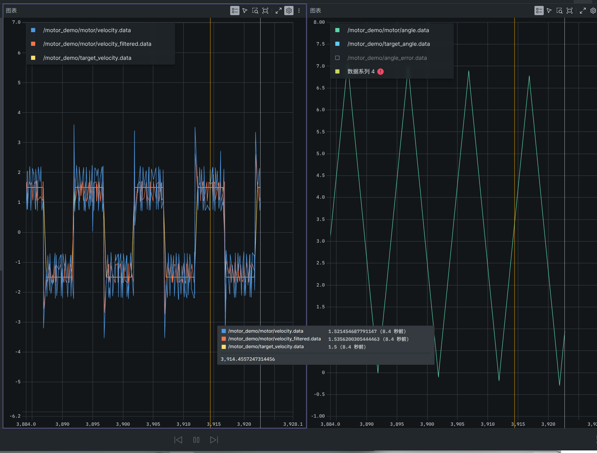

# RMCS 作业仓库

> 基于 [Alliance-Algorithm/RMCS](https://github.com/Alliance-Algorithm/RMCS)（RoboMaster 机器人控制框架 / ROS2）的个人作业仓库。
> 官方框架保持不动，任务做在 `rmcs_ws` 和各任务自己的 `*_ws` 里，文档按周放在 `docs/zh-cn/<周次>/`。

## 目录

- [周次进度](#周次进度)
- [第三周](#第三周)
  - [任务一览](#任务一览)
  - [怎么跑](#怎么跑)
- [第二周（已完成）](#第二周已完成)
- [仓库结构](#仓库结构)
- [环境与快速开始](#环境与快速开始)
- [相关文档](#相关文档)

## 周次进度

| 周次 | 内容 | 状态 |
|---|---|---|
| 第二周 | 电机驱动：任务二·速度闭环、任务三·双环控角度（真机验证通过） | ✅ 完成 |
| 第三周 | 任务一 PID 参数分析 / 任务二 底盘运动学 + 龙门架 / 任务三 OpenCV 轮廓检测 / 任务四 A\* 寻路 | ✅ 完成 |

## 第三周

### 任务一览

| 任务 | 内容 | 文档 | 代码 |
|---|---|---|---|
| 任务一 | 三个场景的 PID 参数意义分析：① 舵轮底盘的舵向电机（外环/内环）、② 控制摩擦轮转速、③ 自瞄时的云台控制 | [pid_tuning_reference.md](docs/zh-cn/第三周/pid_tuning_reference.md) | 只读官方 yaml 源码做分析，没有新增代码 |
| 任务二 | 3.1 底盘运动解算（全向轮 / 舵轮）、3.2 龙门架运动 | 同上（§3.1 / §3.2） | `rmcs_ws/src/rmcs_core/src/hardware/gantry.cpp`、`.../controller/gantry/gantry_controller.cpp`、`rmcs_ws/src/rmcs_bringup/config/gantry.yaml` |
| 任务三 | OpenCV 轮廓检测：用最基础的 5 个函数做，跟官方网页的输出做对比 | [task3.md](opencv_ws/task3.md) | `opencv_ws/task3/` |
| 任务四 | 经典 A\* 寻路：4 邻域 + 曼哈顿距离，跑了 5×5 / 12×12 / 房间 / 随机四张图 | [task4.md](navigation_ws/task4.md) | `navigation_ws/task4/` |

### 怎么跑

**任务三（轮廓检测）**：不带参数也能跑，图片和输出图都在 `task3/` 里

```bash
cd opencv_ws/task3
cmake -S . -B build && cmake --build build -j8
./build/contour_detect                                   # 用默认图片
./build/contour_detect images/butterfly.jpg output/butterfly.png 35 105   # 也可以自己指定图片和 Canny 两个阈值
```

**任务四（A\* 寻路）**：地图写在代码里，不用给参数

```bash
cd navigation_ws/task4
cmake -S . -B build && cmake --build build -j8
./build/task4_astar        # 结果图输出到 output/
```

**任务二（龙门架）**：只构建改动的两个包，然后按 `gantry.yaml` 启动

```bash
cd rmcs_ws
colcon build --packages-select rmcs_core rmcs_bringup
source install/setup.bash
ros2 launch rmcs_bringup rmcs.launch.py robot:=gantry
```

## 第二周（已完成）

电机驱动的两个任务，都在真机上验证过：

| 任务 | 内容 | 状态 |
|---|---|---|
| 任务一 | 发射机构组件链路分析（17mm / 42mm 火力链路，只读分析） | ✅ 完成 |
| 任务二 | **速度闭环**：目标速度 → 内环速度 PID → M3508 跟随；测速过中值 + 低通滤波 | ✅ 真机通过 |
| 任务三 | **双环控角度**：外部发角度 → 外环角度 PID → 内环速度 PID 串级 → 走**优弧**到位 | ✅ 真机通过 |

- 硬件：CBoard（USB 串口）+ M3508（CAN1，拨码 id=3，已开多圈角度和反向修正）+ DR16 遥控（当前没有遥控器，相关方案默认注释掉）
- 测试方案都在 `rmcs_ws/src/rmcs_bringup/config/test.yaml` 里切，A（角度）/ B（速度）/ C（摇杆）三套
- 观测用 Foxglove WebSocket 桥（端口 8765）

**速度模式** · 速度方波 ±1.5 rad/s：黄=目标速度、蓝=原始测速、橙=滤波后贴住目标



**角度模式** · 目标角按正弦变化，实际角一路贴住目标角


完整说明（链路分析 + 任务二/三教程 + 接口 + 踩坑清单）见 [第二周文档](docs/zh-cn/第二周/firing_mechanism_chain.md)。

## 仓库结构

```
docs/zh-cn/
├── 原/                          官方原有的中文文档（环境、镜像、交叉编译、nvim 等）
├── 第二周/                       任务一分析 + 任务二/三教程（含 assets / mermaid）
│   └── firing_mechanism_chain.md
└── 第三周/
    └── pid_tuning_reference.md   任务一（PID 三场景）+ 任务二（底盘运动学 + 龙门架）

rmcs_ws/src/rmcs_core/            第三周任务二新增的源码（官方库只动了 plugins.xml 登记）
├── src/hardware/gantry.cpp               龙门架硬件层：CAN 收发、两个电机
├── src/controller/gantry/gantry_controller.cpp   龙门架控制层：位置环 + 速度环、同步纠偏
└── src/controller/motor_demo/            第二周任务的组件（速度/角度目标源、滤波等）
rmcs_ws/src/rmcs_bringup/config/
├── gantry.yaml                           龙门架：串口、导程、PID 参数、目标高度
└── test.yaml                             第二周：A(角度)/B(速度) 两套测试方案

opencv_ws/
├── task3.md                      第三周任务三文档
├── task3/                        任务三代码 + 图片 + 结果图
└── opencv/                       官方 OpenCV 源码（只作本地参考，没入库）

navigation_ws/
├── task4.md                      第三周任务四文档
├── task4/                        任务四代码 + 结果图
└── Hybrid_Astar_for_Navigation/  参考用的开源实现（只作参考，没入库）
```

## 环境与快速开始

开发环境用官方 Dev Container（Docker）：

1. 克隆并进入容器：
   ```bash
   git clone --recurse-submodules https://github.com/Alliance-Algorithm/RMCS.git
   code ./RMCS        # 然后选 "Dev Containers: Reopen in Container"
   ```
2. 容器内构建：
   ```bash
   build-rmcs
   # 或者只构建改动的包：
   cd rmcs_ws && colcon build --packages-select rmcs_core rmcs_bringup
   ```
3. 接上硬件后启动（`robot:=test` 会加载 `test.yaml`）：
   ```bash
   cd /workspaces/RMCS/rmcs_ws && source install/setup.bash
   ros2 launch rmcs_bringup rmcs.launch.py robot:=test
   ```
4. 开观测桥，浏览器里用 Foxglove 连 `ws://localhost:8765`：
   ```bash
   ros2 run foxglove_bridge foxglove_bridge --ros-args -p port:=8765
   ```

> USB 设备号变了执行 `bash /home/ubuntu/fix_usb.sh`；板子卡死要断电重启板子主电源（详见第二周文档的踩坑清单）。

## 相关文档

- 第三周任务一 + 任务二：[docs/zh-cn/第三周/pid_tuning_reference.md](docs/zh-cn/第三周/pid_tuning_reference.md)
- 第三周任务三：[opencv_ws/task3.md](opencv_ws/task3.md)
- 第三周任务四：[navigation_ws/task4.md](navigation_ws/task4.md)
- 第二周任务一/二/三：[docs/zh-cn/第二周/firing_mechanism_chain.md](docs/zh-cn/第二周/firing_mechanism_chain.md)
- 官方原有的中文文档（环境搭建、镜像、交叉编译等）：[docs/zh-cn/原/](docs/zh-cn/原/)
- 上游 Wiki：[Alliance-Algorithm/RMCS Wiki](https://github.com/Alliance-Algorithm/RMCS/wiki/Quick-Start)

> 本仓库是在官方框架上做作业，官方完整文档与部署流程请见上游 [Alliance-Algorithm/RMCS](https://github.com/Alliance-Algorithm/RMCS)。
