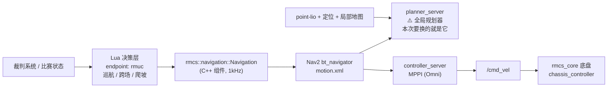

# 导航方向 · 全局规划器选型与调参

> 对应《2027赛季算法组培训考核作业细则》**§3 导航方向**
> 状态标注：✅ 已核实（读源码/跑命令验证过） · ⏳ 待验证（需实机或仿真确认）

---

## 一、任务要求

细则原文（§3 导航方向）：

| 项 | 内容 |
|---|---|
| **目标** | 使用 `rmcs-navigation-deps` 控制哨兵，挑选一个全局规划器（**不能用现在的 NavfnPlanner**），做到在实际场地的跨场导航 |
| **要求 1** | 要切换全局规划器，地图会给出 |
| **要求 2** | 独立完成，通过调整规划器参数，实现导航过程中**无明显卡顿** |
| **验收 1** | 讲讲**为什么挑选这个规划器**，它和我们现有规划器的差异 |
| **验收 2** | 效果演示，代码提交 GitHub |
| **验收 3** | 讲讲在实际调试过程中的**调参思路** |

拆解成可执行目标：**换规划器 → 调参调到不卡 → 跑通跨场 → 讲得出理由。**

---

## 二、基线确认：现在的规划器确实是 NavfnPlanner ✅

### 2.1 结论

**细则表述正确**，"现在的规划器"就是 `nav2_navfn_planner::NavfnPlanner`：

```yaml
# rmcs-navigation/config/motion.yaml（上游 main，已实测确认）
planner_server:
  ros__parameters:
    planner_plugins: ["GridBased"]
    GridBased:
      plugin: "nav2_navfn_planner::NavfnPlanner"   # ← 现在的规划器
      tolerance: 0.5
      use_astar: true
      allow_unknown: true
      use_final_approach_orientation: false
```

运行时实测（`ros2 param get`）：

```
$ ros2 param get /planner_server GridBased.plugin
String value is: nav2_navfn_planner::NavfnPlanner
```

### 2.2 曾经踩过的坑：读到了过期的 commit

第一次拉取时，父仓库 `rmcs-navigation-deps` pin 的子模块是 **`d57fa1c`（2026-05-22）**，
那个版本里规划器是 `ThetaStarPlanner`，一度让人以为"细则过时了"。实际是**父仓库 pin 的版本太旧**。

查历史可见规划器被主动改回过 NavFn：

```
$ git log -p d57fa1c..main -- config/motion.yaml | grep -E '^[+-].*plugin:'
commit 3663d5f  wip: localization api, refactor impl and adjust nav2 config
-      plugin: "nav2_theta_star_planner::ThetaStarPlanner"
+      plugin: "nav2_navfn_planner::NavfnPlanner"
```

时间线：

| commit | 日期 | 规划器 | 说明 |
|---|---|---|---|
| `d57fa1c` | 2026-05-22 | ThetaStar | 父仓库 pin 的版本，**且缺 `rmcs_description` 依赖声明，编译不过** |
| `3663d5f` | — | → NavFn | 主动改回 |
| `632962c`（main，2026-08-11） | 2026-08-11 | **NavFn** | 上游最新，含依赖修复 |

**教训**：判断"现在用什么"要以**上游最新分支**为准，不能只看父仓库 pin 的 commit。

### 2.3 因此基线取 main

工作分支基于 **上游 `main`（`632962c`）**，而不是父仓库 pin 的 `d57fa1c`，原因有二：

1. `d57fa1c` **缺少 `<depend>rmcs_description</depend>`，根本编译不过**：
   ```
   fatal error: rmcs_description/sentry_description.hpp: No such file or directory
   ```
   `main` 的 `632962c` 提交正是 "fix: declare rmcs_description dependency"。
2. 细则所指的 NavFn 只存在于 `main` 上。

> ⚠️ 这是个需要**向组长报备**的偏离：我们没沿用 `rmcs-navigation-deps` 默认 pin 的版本，
> 因为那个版本无法构建。建议同时反馈"父仓库的子模块指针该更新了"。

---

## 三、已核实的事实

### 3.1 依赖已就位 ✅

`rmcs_ws/src/rmcs-navigation-deps/` 已拉取，含 6 个子模块：

| 子模块 | 作用 |
|---|---|
| `rmcs-navigation` | **本次任务主战场**：Nav2 配置 + Lua 决策 |
| `rmcs-local-map` | 局部地图（`/local_map`，frame = `base_link`） |
| `rmcs-localization` | 定位 |
| `point-lio` | LiDAR 惯性里程计 |
| `livox-ros-driver2` / `odin-ros-driver` | 雷达驱动 |

`colcon list` 识别到的包名：`rmcs-navigation`、`rmcs_local_map`、`rmcs_localization`、`point_lio`、`livox_ros_driver2`、`odin_ros_driver`。

### 3.2 地图**已有**，不需要等扫描件 ✅

`rmcs-navigation/maps/` 目录（以 `main` 为准）：

| 文件 | 像素 | 分辨率 | 实际覆盖 |
|---|---|---|---|
| **`rmuc-v2.png`** + `rmuc.yaml` | 292 × 161 | 0.1 m/px | **29.2 m × 16.1 m**（RMUC 场地，**默认使用这张**） |
| `rmuc-v3.png` | 292 × 161 | — | 同尺寸的另一个版本，暂无 yaml 引用 |
| `rmul.png` + `rmul.yaml` | 240 × 160 | 0.05 m/px | 12.0 m × 8.0 m（RMUL 场地） |
| `战队.png` + `战队.yaml` | 343 × 110 | 0.1 m/px | 34.3 m × 11.0 m（另一张场地） |
| `empty.png` + `empty.yaml` | 2000 × 2000 | 0.05 m/px | 100 m × 100 m 空图，做对照/局部 mock |

已验证 `rmuc-v2.png` 内容是**真实场地结构**（中央环形障碍、两侧立柱、对称通道），非占位图。

`static.launch.yaml` 的 `global_map` 参数默认 `rmuc`，而 `rmuc.yaml` 里 `image: rmuc-v2.png`，
所以**实际生效的是 `rmuc-v2.png`**：

```yaml
image: rmuc-v2.png
mode: trinary
resolution: 0.100000
origin: [-4.300000, -8.000000, 0.000000]
negate: 0
occupied_thresh: 0.650000
free_thresh: 0.196000
```

→ 组长后续给实际场地扫描件时，**只需替换 png + 改 `resolution` / `origin`**，配置代码不用动。
也可以直接加一组新的 `xxx.yaml`，启动时用 `global_map:=xxx` 切换。

### 3.3 容器里可用的全局规划器 ✅

`/opt/ros/jazzy/lib/` 下三个插件都已安装，可随时切换：

```
libnav2_navfn_planner.so | libnav2_theta_star_planner.so | libnav2_smac_planner.so (+ _2d / _lattice)
```

对应包：`ros-jazzy-nav2-navfn-planner`、`ros-jazzy-nav2-theta-star-planner`、`ros-jazzy-nav2-smac-planner`（均 1.3.12）。

### 3.4 关键参数现状 ✅

| 项 | 值（`main` 实测） | 位置 |
|---|---|---|
| 全局规划器 | `nav2_navfn_planner::NavfnPlanner`，`tolerance: 0.5`，`use_astar: true` | `config/motion.yaml` |
| 全局代价地图 | 未显式指定 `resolution`（继承地图 0.1 m） | `config/motion.yaml` |
| 全局 `footprint` | `[[0.1, 0.1], [0.1, -0.1], [-0.1, -0.1], [-0.1, 0.1]]`（**0.2 m 见方**） | `config/motion.yaml` |
| 全局膨胀 | `inflation_radius: 0.5` / `cost_scaling_factor: 0.5` | `config/motion.yaml` |
| 局部代价地图 | `16 × 16 m`，`resolution: 0.04`，rolling window | `config/motion.yaml` |
| 局部 `footprint` | `[[0.2475, …]]`（**0.495 m 见方**） | `config/motion.yaml` |
| 局部膨胀 | `inflation_radius: 0.5` / `cost_scaling_factor: 0.5` | `config/motion.yaml` |
| 局部规划器 | `nav2_mppi_controller::MPPIController`，`motion_model: Omni` | `config/motion.yaml` |
| 全局重规划频率 | `RateController hz="1.0"`（行为树里锁 1 Hz） | `config/motion.xml` |
| 目标容差 | `xy_goal_tolerance: 0.1` | `config/motion.yaml` |

> ⚠️ **两处值得注意的不一致**（可能是调参切入点）：
> 1. **全局与局部的 footprint 不一致**：全局 0.2 m 见方，局部 0.495 m 见方。
>    底盘的 `footprint` 源自"斜边 0.7 m"换算出的 0.2475（见 `doc/adjustment-navigation.md` §6），
>    0.1 更像占位值。全局图偏小会让**全局路径过于贴近障碍**。
> 2. **膨胀半径 0.5 m 相对 0.1 m 地图偏大**：0.5 m 只占 5 格，
>    而车宽 0.495 m 时就占约 5 格，窄门洞（RMUC 的"狗洞"）有**膨胀堵死导致无解**的风险。
>    这两个点在换成 `SmacPlanner2D` 后需要重点试。

> MPPI 已是**各向同性**配置（`vx_std == vy_std == 0.55`，`wz_* = 0.001` 为数值稳定用的 epsilon），符合全向底盘。

### 3.5 前人留下的宝贵复盘 ✅

`rmcs-navigation/doc/adjustment-navigation.md` 是上一轮的完整调参复盘，**必读**，其中几条直接相关：

1. **局部图不能当全局图**：把 `/local_map`（`base_link`）当 `global_costmap` 的 `StaticLayer` 会导致全局图被局部窗口覆盖（2000×2000 退化成 ~400×400），报 `Goal outside bounds` / `Start occupied`。
2. `DWB → MPPI` 的切换历程与踩坑（`wz_max` 全零导致数值奇异、`near_collision_cost` 必须是整数）。
3. 报错速查表（`Goal outside bounds`、`Start occupied`、`Optimizer fail to compute path`）。
4. 联调 SOP：`service rmcs start/stop`、生命周期检查、`ros2 param get` 回读确认"真生效"。

---

## 四、系统架构与文件地图

### 4.1 调用链



### 4.2 关键文件

| 文件 | 作用 |
|---|---|
| `rmcs-navigation/config/motion.yaml` | **全局规划器 + 全局/局部代价地图 + MPPI 控制器参数（主战场）** |
| `rmcs-navigation/config/motion.xml` | 行为树（重规划频率、恢复链） |
| `rmcs-navigation/launch/motion.launch.yaml` | 启动 `bt_navigator` / `planner_server` / `controller_server` |
| `rmcs-navigation/maps/*.png/.yaml` | 场地地图 |
| `rmcs-navigation/config/sensor.yaml` | 全局地图话题与 frame |
| `rmcs-navigation/doc/adjustment-navigation.md` | 前人调参复盘 |
| `rmcs_bringup/config/navigation_test.yaml` | RMCS 侧接入点（组件登记 + `endpoint: rmuc`） |

### 4.3 接入方式

导航是作为 **RMCS 插件组件**运行的，接线靠话题名同名连接，底盘侧已在监听：

| 底盘侧文件 | 监听话题 |
|---|---|
| `rmcs_core/src/controller/chassis/chassis_controller.cpp:42-44` | `/rmcs_navigation/enable_control`、`/chassis_velocity`、`/chassis_behavior` |
| `rmcs_core/src/controller/chassis/chassis_power_controller.cpp:33` | `/rmcs_navigation/enable_supercap` |
| `rmcs_core/src/controller/chassis/sentry_climber.cpp:165-166` | `/rmcs_navigation/request/cross_direction`、`/request/is_climb` |
| `rmcs_core/src/controller/gimbal/eccentric_dual_yaw.cpp:191-192` | `/rmcs_navigation/enable_control`、`/gimbal_toward` |

→ **跨场导航不只是"两点连线"**：经过起伏路段/公路区时要走 `sentry_climber` 的 climb 事件链路，这对规划器的要求是"整张大地图上跨区连通"（`allow_unknown: true`、膨胀别把门洞堵死）。

---

## 五、规划器选型

### 5.1 候选对比

| 规划器 | 原理 | 优点 | 缺点 |
|---|---|---|---|
| `NavfnPlanner`（**现状 = 基线**） | Dijkstra/A\* 栅格势场搜索 | 稳、老牌、行为可预测 | 路径**贴障碍**；输出折线无平滑；大图慢；膨胀大时易无解 |
| `ThetaStarPlanner`（曾被用过，`3663d5f` 已换回 NavFn） | A\* + 视线检测，任意角度 | 路径短、直、转折少 | 依赖膨胀提供安全距离，安全裕度靠膨胀硬撑 |
| **`SmacPlanner2D`** ⭐ | A\* + **多分辨率降采样** + 代价感知 + 内置平滑 | 路径平滑；**把"离障碍远近"纳入搜索**；大图快；参数友好 | 需要调 smoother；分辨率粗时路径偏糙 |
| `SmacPlannerHybrid` | 2D + Dubin/Reeds-Shepp 运动学 | 满足最小转弯半径 | 参数多、窄道易无解 |
| `SmacPlannerLattice` | 状态格 + 运动基元 | 最贴运动学 | 配置最复杂，新手不宜 |

### 5.2 选型结论：`SmacPlanner2D`

**三条理由（验收 1 的答案）**：

1. **它把"离障碍有多远"直接算进搜索代价**（`cost_penalty`），路径天然被推到通道中间。相比之下 NavFn 只保证"格数最短"，路径常贴障碍边缘走；哨兵车宽 0.495 m，实车跟踪贴墙路径必须频繁微调，表现就是"顿"。
2. **多分辨率降采样**（`downsampling_factor`）：先在粗网格搜、再逐步细化，大地图上比 NavFn/ThetaStar 快很多——这是"不卡顿"的第二层来源。
3. **内置路径平滑器**（`smoother`，`w_smooth` / `w_data`）：NavFn 出来的是折线，每个转折点速度几乎掉到 0，看起来就是"一格一格往前蹭"；Smac2D 自带平滑，不用自己写后处理。

> **一句话版本**：*选 Smac2D，因为它把膨胀代价纳入搜索 + 多分辨率加速 + 内置平滑，同时解决了 NavFn 路径贴墙和折线转折导致的卡顿。*

⏳ 待验证：`SmacPlanner2D` 在这个 0.1 m 粗栅格 + 0.3 m 膨胀的组合下，窄门洞是否仍可通行。

---

## 六、调参思路

### 6.1 先定位"卡在哪一环"，不要盲调

```bash
ros2 topic hz /plan                          # 规划输出是否稳定、有无长时间空档
ros2 topic echo /global_costmap/costmap --once | grep -A5 info   # 全局图尺寸是否异常
ros2 param get /planner_server GridBased.plugin                  # 确认插件真的换了
```

| 现象 | 大概率是 | 先看哪 |
|---|---|---|
| `/plan` 很久才出一次 | **全局规划慢** | `resolution`、`downsampling_factor` |
| `/plan` 频率正常但车一顿一顿 | **局部跟踪**问题 | MPPI 参数、路径平滑度 |
| 直接报规划失败 | **无解** | `inflation_radius`、门洞宽度、`allow_unknown` |
| 起点就报 occupied | 起点落在膨胀区 | `inflation_radius`、footprint |

**「无卡顿」的客观证据**：`/plan` 输出频率稳定 + 重规划过程中 `/cmd_vel` 无突变。用 Foxglove（`ws://localhost:8765`）看 `/plan`、`/global_costmap`、`/local_costmap`。

### 6.2 调参顺序：从粗到细，一次只动一个

| 顺序 | 参数 | 文件 | 怎么动 | 预期现象 |
|---|---|---|---|---|
| 1 | 全局代价地图 `resolution` | `motion.yaml` | 显式写 0.1，必要时降到 0.05 对比 | 变粗→快，变细→慢但精致 |
| 2 | `inflation_radius` | `motion.yaml` | 0.3 附近小步试 | 调大易**搜不到路**，调小易贴墙 |
| 3 | `cost_scaling_factor` | `motion.yaml` | 0.5 附近 | 越小代价衰减越慢，越"怕墙" |
| 4 | `SmacPlanner2D.cost_penalty` | `motion.yaml` | 2.0 → 5.0 | 越大越往通道中间，过大绕远 |
| 5 | `downsampling_factor` | `motion.yaml` | 2 → 4 | 越大越快，路径越糙 |
| 6 | `tolerance` / `max_on_approach_iterations` | `motion.yaml` | 0.1 → 0.2 | 终点附近"转圈找不到解"就调大 |
| 7 | `smoother.w_smooth` / `w_data` | `motion.yaml` | 0.3 / 0.2 起步 | `w_data` 过小会平滑到撞障碍 |
| 8 | 重规划频率 | `motion.xml` | 行为树 `RateController hz="1.0"` | 别设太高，高频重规划＝明显卡顿 |

**调参记录的写法**（验收 3 要的就是这个）：每改一个参数 → 记录旧值/新值 → 录一小段 → 写现象。例如：

```
改动: GridBased.cost_penalty 2.0 -> 4.0
现象: 路径与障碍边缘间距由 ~0.1m 增至 ~0.3m；/plan 耗时基本不变
结论: 保留。解决贴墙导致的局部降速抖动
```

### 6.3 参数在线试，不用反复重编译

```bash
ros2 param set /planner_server GridBased.cost_penalty 4.0
ros2 param get /planner_server GridBased.cost_penalty     # 回读确认真生效
```

试出满意值后，**再落回 `motion.yaml`** 形成提交。

---

## 七、验证与留痕流程

### 7.1 运行：**无需机器人**的静态测试入口 ✅

`rmcs-navigation` 自带 `launch/static.launch.yaml`，专门用于**纯软件联调**：

> "为纯软件联调提供一个稳定、最小的导航启动环境。在没有任何真实传感器、里程计或 SLAM 输出时，
> 验证导航链路本身是否能正常启动。"

它启动的内容：

| 启动 | 说明 |
|---|---|
| `local_map`（mock） | 用 `maps/empty.yaml`，frame = `base_link` |
| `global_map` | 用 `maps/<global_map>.yaml`（默认 `rmuc`） |
| 静态 TF | `world → odom`、`odom → base_link` |
| `motion.launch.yaml` | `bt_navigator` + `planner_server` + `controller_server` |
| `foxglove_bridge` | 可视化观测 |

**不启动**：传感器驱动、SLAM/定位、`rmcs_local_map`、`point_lio`。

```bash
# 构建（注意：必须用 /opt/cmake 的 CMake ≥ 3.30，系统自带 3.28 太旧）
bash -lc 'export PATH=/opt/cmake/bin:$PATH && cd /workspaces/RMCS/rmcs_ws \
  && source /opt/ros/jazzy/setup.bash && source install/setup.bash \
  && colcon build --packages-up-to rmcs-navigation --symlink-install'

# 启动静态导航栈（不需要 C 板、不需要雷达）
bash -lc 'cd /workspaces/RMCS/rmcs_ws && source install/setup.bash \
  && ros2 launch rmcs-navigation static.launch.yaml'
```

实测启动结果（4 个节点全部 `active`）：

```
/bt_navigator          active [3]
/planner_server        active [3]
/controller_server     active [3]
/global_map            active [3]
```

**这个入口的价值**：

1. **不用等机器人**就能验证规划器切换是否生效；
2. 可以**在线改参数**观察效果，不用反复重编译：
   ```bash
   ros2 param get  /planner_server GridBased.plugin      # 看当前规划器
   ros2 param set  /planner_server GridBased.plugin nav2_smac_planner::SmacPlanner2D
   ```
   ⚠️ 但"加载哪个插件类名"在进程启动时确定，**换插件必须改 yaml + 重启**；
   `ros2 param set` 只适合调**数值型**参数（如 `cost_penalty`、`tolerance`）；
3. 配上 Foxglove 能直接看到 `/plan`、代价地图，是"无卡顿"判据的来源。

### 7.2 环境踩坑（都实测过）

| 坑 | 现象 | 解决 |
|---|---|---|
| **zsh 下 source ROS setup 失效** | `source /opt/ros/jazzy/setup.bash` 报 `no such file: .../rmcs_ws/setup.sh` | 该脚本用 `BASH_SOURCE[0]` 定位自身，zsh 里为空。**用 `bash -lc '...'` 包一层** |
| **CMake 版本太旧** | `CMake 3.30 or higher is required. You are running version 3.28.3` | 用 `/opt/cmake/bin`（4.2.3）：`export PATH=/opt/cmake/bin:$PATH` |
| **`build-rmcs` 与现有 install 冲突** | `install directory was created with the layout 'isolated'` | 该脚本用 `--merge-install`，与现有 isolated 布局不兼容；直接用 `colcon build` 即可 |
| **父仓库 pin 的版本编译不过** | `rmcs_description/sentry_description.hpp: No such file or directory` | 见第二节：切到上游 `main` |

### 7.3 完整链路（接机器人时）

```bash
ros2 launch rmcs_bringup rmcs.launch.py robot:=navigation_test
```

观测桥：`ws://localhost:8765`（Foxglove）。

### 7.4 基线先行（**关键，别跳过**）

先用**当前规划器**（ThetaStar，或按组长要求临时切回 NavFn）跑通一次并录屏存档。
没有基线，"与现有规划器的差异"就只能空谈，验收 1 直接丢分。

### 7.5 留痕位置

改动文件在 `rmcs-navigation` **子模块**内，不在作业仓库里，所以分两处：

| 位置 | 内容 | 状态 |
|---|---|---|
| fork `gebilaowuxiaoyu123/rmcs-navigation`，分支 `feat/smac-global-planner` | 规划器相关改动（`config/motion.yaml` 等） | ✅ fork 与分支已就绪（基于上游 `main`） |
| `RMCS_Test`（本作业仓 `main`） | 本文档 + `README.md` 的「导航方向」章节 | ✅ 已推送 |

子模块 remote 已按如下约定配置：

| remote | 指向 | 用途 |
|---|---|---|
| `origin` | `gebilaowuxiaoyu123/rmcs-navigation`（自己的 fork） | `git push` 默认去这里 |
| `upstream` | `Alliance-Algorithm/rmcs-navigation`（官方） | 只用于 `git fetch` 拉更新 |

```bash
cd rmcs_ws/src/rmcs-navigation-deps/rmcs-navigation
git checkout feat/smac-global-planner

# 改完 config/motion.yaml 后
git add config/motion.yaml
git commit -m "feat(nav): ..."
git push          # → origin，也就是自己的 fork
```

> 其余第三方仓库（`opencv`、`Hybrid_Astar_for_Navigation`、`fast_tf`、`rmcs_auto_aim_v2`、
> `rmcs-navigation-deps` 及其它 5 个子模块）保持指向官方，不推送。详见 `README.md` 的「仓库与推送约定」。

### 7.6 网络注意

本机 **GitHub HTTPS 直连超时，必须走 SSH**（已配置）：

```bash
git config --global url."git@github.com:".insteadOf "https://github.com/"
```

---

## 八、待办清单

- [x] 确认基线：现在的规划器就是 `NavfnPlanner`（细则表述正确）
- [x] 拉取依赖（`rmcs-navigation-deps` + 6 个子模块）
- [x] 确认场地地图可用（`maps/rmuc-v2.png`，292×161 px @ 0.1 m）
- [x] fork `rmcs-navigation`，推送分支 `feat/smac-global-planner`（基于上游 `main`）
- [x] 补齐运行时依赖：`nav2-mppi-controller`、`py-trees`
- [x] 构建通过：`rmcs-navigation` 编译成功
- [x] 验证静态测试栈可启动：4 个节点全部 `active`
- [ ] **向组长报备**：未沿用父仓库 pin 的 `d57fa1c`（它编译不过），改用上游 `main`
- [ ] 用**当前规划器**（NavFn）跑通一次 + 录屏（基线）
- [ ] 切换 `SmacPlanner2D`，编译、跑通、录屏（对比素材）
- [ ] 按 6.2 的顺序调参，逐条记录现象
- [ ] 确认 `/plan` 频率稳定（"无卡顿"的客观证据）
- [ ] 跨场验证：门洞可通行、起伏路段能规划到对面
- [ ] 本文档补上真实数据 + 对比截图
- [ ] 准备三句话：**为什么选它 / 和现有规划器差在哪 / 调参怎么想的**

---

## 九、已知风险

| 风险 | 说明 | 应对 |
|---|---|---|
| **父仓库 pin 的版本过旧且编译不过** | `rmcs-navigation-deps` pin 的是 `d57fa1c`（5 月，ThetaStar，缺依赖声明），上游 `main` 已是 8 月版本 | 已切到 `main`；建议同时反馈"父仓库子模块指针该更新" |
| 与 `rmcs-navigation-deps` 默认不一致 | 我们的基线是上游 `main`，不是父仓库默认 pin 的 commit | 报备组长；说明 pin 的版本无法构建 |
| 地图偏粗 | 292×161 px @ 0.1 m，膨胀 0.3 m 只占 3 格 | 窄门洞可能无解；必要时提高分辨率或降膨胀 |
| 磁盘紧张 | 根分区剩余约 16 GB | 全量 `colcon build`（含 `point-lio`）前留意空间 |
| 子模块 detached HEAD | 直接提交会丢 | 已建分支 `feat/smac-global-planner` ✅ |
| 无实车 | 调参最终要实机 | 先用 `static.launch.yaml` 纯软件验证，落盘前需实机确认 |
| 静态测试的局限 | mock 的 `local_map` 是空图，没有真实障碍与传感器噪声；**验证不了跟随质量** | 静态栈只能验证"规划链路 + 参数加载 + 规划速度"，跟随效果仍需实机 |
