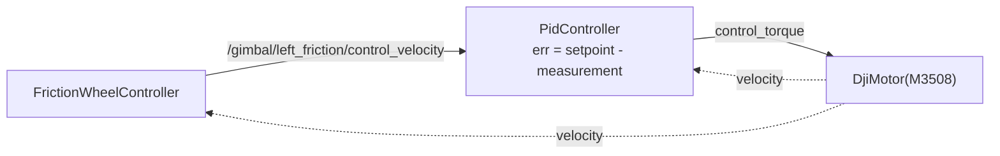
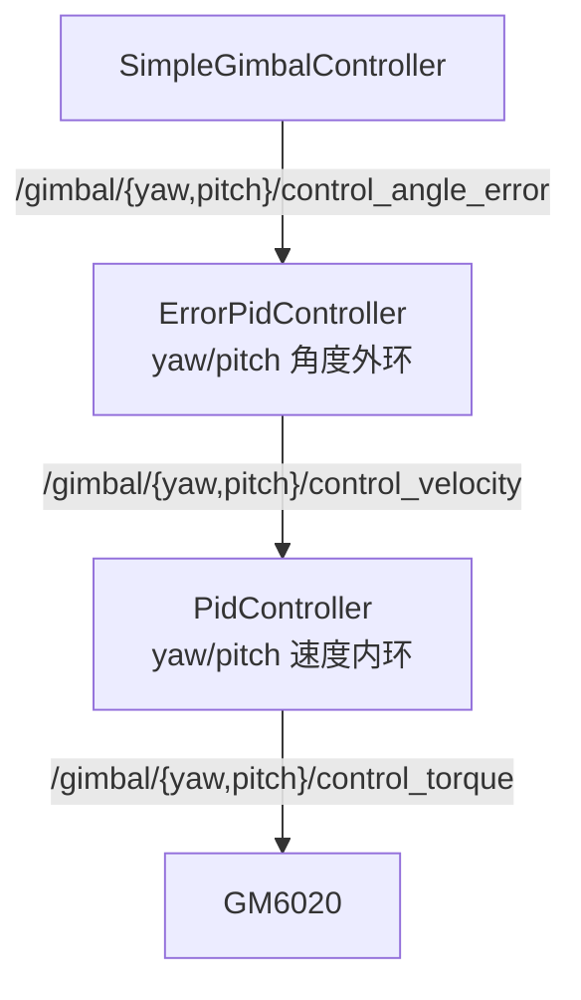

# 任务一 · PID 各参数意义分析（三场景）

> 三个场景：**舵轮底盘的舵向电机（外环/内环）**、**控制摩擦轮转速**、**自瞄时云台控制**
> 代码在 `rmcs_ws/src/`，配置在 `rmcs_ws/src/rmcs_bringup/config/`。

---


## 一、参考资料（本地源码为准，RMCS 官方 Wiki 作框架背景）

### A. 本地仓库（可直接引用行号，最可靠）

| 资料 | 支撑哪一点 |
|---|---|
| `rmcs_core/src/controller/pid/pid_calculator.hpp` | PID 算法本体：差分微分、条件积分（积分分离）、限幅 |
| `rmcs_core/src/controller/pid/matrix_pid_calculator.hpp` | 向量版，舵轮 4 电机一次算 |
| `rmcs_core/src/controller/pid/pid_controller.cpp` / `error_pid_controller.cpp` | 两种封装：`err=sp-pv` vs 直接吃误差 |
| `rmcs_core/src/hardware/device/dji_motor.hpp:98-127` | 扭矩常数 / 最大扭矩（算"增益强弱"的关键） |
| `rmcs_bringup/config/{omni-infantry,deformable-infantry-omni,sentry,steering-hero-little-six-friction,flight}.yaml` | 各车真实参数 |
| `docs/zh-cn/firing_mechanism_chain.md` §5 | 仓库自带调参对照表（"到位留残差→外环 ki"等） |
| `README.md` | 已完成的真机验证结论（任务二/三） |

### B. RMCS 官方 Wiki（框架背景，无 PID 整定专页）

| 页面 | 能引用什么 |
|---|---|
| [Home](https://github.com/Alliance-Algorithm/RMCS/wiki) | 框架定位："用软件工程的思维重塑嵌入式开发" |
| [Component Development](https://github.com/Alliance-Algorithm/RMCS/wiki/Component-Development) | `update()` 1kHz 单线程；`InputInterface/OutputInterface` 数据交换；参数经 yaml 的 `component_name: ros__parameters:` 注入 |

> ⚠️ RMCS Wiki 只覆盖**框架用法**（组件如何注册/接线/读参数），没有 PID 整定专页；PID 参数与整定结论均以第一节 A 的**本地仓库源码**为准。

---

## 二、总览：三个场景 × 五项要求

| | ① 舵轮舵向电机 | ② 摩擦轮转速 | ③ 自瞄云台 |
|---|---|---|---|
| **控制需求** | 角度精准+快+抗反扭矩 | 转速稳+打弹快恢复+启停平滑 | 静态精度达火控容差+快跟随+无超调 |
| **期望效果** | 稳态角误差≈0，转向不摆 | 转速贴住工作点，每发弹速一致 | 角误差 < 0.07/0.04 rad |
| **参数配合** | 角度外环 **P** + 速度内环 **P** | **PD**（步兵）/ **P**（英雄） | yaw: **P(+前馈)**；pitch: **P+I+D+重力前馈** |
| **理由** | 输出是速度指令被内环闭环；稳态静止无持续负载 | D 补打弹瞬态；I 会因打弹饱和致弹速不一致 | yaw 无重力怕噪声；pitch 有重力需阻尼 |
| **依据** | 见第一节 A：`steering_wheel_controller.cpp`、`sentry.yaml` | 见第一节 A：`friction_wheel_controller.cpp`、`omni-infantry.yaml` | 见第一节 A：`deformable_infantry_gimbal_controller.cpp`、`sentry.yaml` |

---

## 三、场景①：舵轮底盘的舵向电机（外环 / 内环）

### 3.1 先分清内外环


- **内环 = 速度环**（快、贴近电机）：`steering_velocity_pid_`
- **外环 = 角度环**（慢、离目标远）：`steering_angle_pid_`

代码在 `steering_wheel_controller.cpp:405-414`，两个环是**嵌套调用**：

```cpp
Eigen::Vector4d steering_torques = steering_velocity_pid_.update(
    steering_control_velocities                    // 前馈：运动学算出的期望角速度
    + steering_angle_pid_.update(                  // 外环：角度误差 → 目标角速度
        (steering_control_angles - steering_status.angle)
            .unaryExpr([](double diff) { ... 折到 ±π/2 ... }))   // 就近转向（可反装轮）
    - steering_status.velocity);                   // 内环反馈：实测角速度
```

**补充说明。** 内环直接面对电机、管"速度"：输入角速度误差、输出扭矩，带宽高、响应快，负责把实际转速尽快贴住指令，并顶掉摩擦、打滑等扰动。外环离被控量（转角）近、管"角度"：输入转向角误差、输出目标角速度，自己不直接驱动电机，只给内环下达任务。之所以拆成两级，是因为既要"转得准"又要"转得稳"——外环保证方向对，内环保证跟得上，两级靠目标角速度串起来，这就是串级（cascade）控制。

### 3.2 控制需求

| 需求 | 具体含义 | 不满足的后果 |
|---|---|---|
| 静态转角精度 | 四个舵向角必须与运动学解算一致 | 平移方向歪、四轮互相"打架"、打滑 |
| 快速、低超调 | 底盘变向要跟手 | 转向慢了迟钝；超调了来回摆 |
| 抗反扭矩 | 底盘运动/打滑时轮子被带转 | 角度漂移，越走越歪 |
| 不打抖 | 4 个转向电机同时抖 = 整车抖 | 底盘高频抖动、轮胎磨损 |
| 单轮力矩足够 | 原地转向需克服轮胎侧向摩擦 | 转不到位 |

### 3.3 期望效果（量化）

- 稳态转向角误差 → 0（因为它是运动学解算的直接输入）
- 转向阶跃后一次到位、无持续振荡
- 前馈提供的角速度使**匀速转向时无滞后**

### 3.4 参数配合（yaml 原文）

哨兵 `rmcs_bringup/config/sentry.yaml`：

```yaml
steering_wheel_controller:
  ros__parameters:
    # ── 内环：速度环（本题重点）──
    steering_velocity_kp: 0.15
    steering_velocity_ki: 0.0
    steering_velocity_kd: 0.0

    # ── 外环：角度环（本题重点）──
    steering_angle_kp: 30.0
    steering_angle_ki: 0.0
    steering_angle_kd: 0.0
    # （其余物理参数 mess/惯量/半径、底盘级与轮子驱动 PID 非本题重点，略）
```

英雄 `steering-hero-little-six-friction.yaml` 只给物理参数（`mess`/`moment_of_inertia`/半径等，非本题重点），**PID 写死在 `hero_steering_wheel_controller.cpp:42-43`**：

```cpp
, steering_velocity_pid_(0.15, 0.0, 0.0)   // 与哨兵 yaml 完全一致
, steering_angle_pid_(30.0, 0.0, 0.0)      // 与哨兵 yaml 完全一致
, wheel_velocity_pid_(0.6, 0.0, 0.0)       // 哨兵是 0.5
```

> 💡 **这个不一致本身就是个结论**：两车舵向参数被验证可共用（0.15/30），只有轮子驱动环因减速比不同（英雄 `2232/169≈13.2`）而略调。

### 3.5 理由

**① 为什么外环 ki = 0？**

P 控制器的固有特性是"必须有误差才能产生输出"，即稳态留静差。但舵轮外环的输出是**目标角速度**，它由内环闭环执行——稳态时只要轮子停了、角度到位了，就没有持续误差可言。加 I 反而会在**内环已有动态**的基础上产生双环积分叠加 → 低频振荡。前馈 `steering_control_velocities` 已经补掉了大部分动态，更没必要用 I 去"试错"。

**② 为什么内环 ki = 0？**

内环是速度环。舵轮的稳态工况是**静止（速度=0）**，"稳态速度静差"对最终角度没有意义（角度是速度的积分，只要最终速度为 0）。I 项在转向过程中会持续累积，反而带来过冲。

**③ 为什么 kp 差 200 倍（30 vs 0.15）却不能说外环"增益更高"？**

量纲不同：

| 环 | 输入 | 输出 | 饱和点 |
|---|---|---|---|
| 外环 | rad（角度误差） | rad/s | `30 × 0.03 rad ≈ 0.9 rad/s` |
| 内环 | rad/s（速度误差） | N·m | `0.15 × 14.8 rad/s ≈ 2.22 N·m` = GM6020 满扭矩 |

GM6020 最大扭矩来自 `dji_motor.hpp:100-104`：`torque_constant = 0.741`、`current_max = 3.0` → `max_torque = 0.741 × 3 = 2.223 N·m`。所以 **0.15 其实很激进**（约 15 rad/s 误差就打满），而 30 对应 0.03 rad≈1.7° 就打满 0.9 rad/s，也合理。

**④ 为什么 kd 可以给 0？**

D 的作用是"阻尼"，代价是放大噪声。舵轮：惯量小、目标角由运动学解算**连续平滑**（无阶跃）、测速来自编码器差分**噪声偏大**。收益 < 风险 → 关掉。若要加，**加在内环**（`steering_velocity_kd`）比外环安全：外环 kd 会把目标角跳变放大成巨大的角速度指令。

**⑤ 注意 dt 效应**

`pid_calculator.hpp` 里微分是**差分**，没有除 dt：

```cpp
if (!std::isnan(last_err_))
    control += kd * (err - last_err_);
```

而 `sentry.yaml` 第一行 `update_rate: 1000.0` → dt = 1ms。所以 `kd` 的等效物理增益是 `kd × 1000`。**这就是为什么全仓库 kd 都很小（0.001~0.3）**——不能拿连续域 PID 的 kd 去套。

### 3.6 小结

外环（角度）纯 P 管"转得准"、内环（速度）纯 P 管"转得稳"，前馈承担大部分角速度需求，因此内外环都不用 I/D；kp 的"强"要看饱和点而非数值（30 → 0.03 rad 打满，0.15 → 15 rad/s 打满 GM6020 扭矩）。

---

## 四、场景②：控制摩擦轮转速

### 4.1 链路



- 上游 `friction_wheel_controller.cpp` **不管 PID**：软启停（`friction_soft_start_stop_step_ = (1/1000)/soft_start_stop_time`）、堵转检测（速度 < 50% 指令持续 200 周期）、发弹检测（主轮"速度下降积分 < -14"）
- PID 层 `pid_controller.cpp`：通用组件
- 硬件层 `omni_infantry.cpp:77-82`：M3508，`reduction_ratio(1.)` 直驱

**补充说明。** 摩擦轮没有角度外环、只有速度环，因为目标只是"稳在某转速"。上游 `FrictionWheelController` 实为带门槛的指令源：软启停斜坡防阶跃冲击、堵转检测（转速长期低于指令一半报 `friction_jammed`）、发弹检测（转速骤降报 `bullet_fired`）。真正闭环的是下方通用 `PidController`。电机为 M3508 直驱，转速即电机轴 rad/s，直接决定 kp/kd 的量级（见 4.5）。

### 4.2 控制需求

| 需求 | 含义 | 后果 |
|---|---|---|
| 稳态转速准且稳 | 转速 → 弹丸初速 → 弹道 → 自瞄能否命中 | 弹速散布、打不准 |
| 打弹后快速恢复 | 弹丸"啃"进摩擦轮瞬间掉速 | 连发时第二发弹速偏低 |
| 启停平滑 | 660 rad/s 直接给会电流冲击、打滑 | 烧电机、轮胎打滑 |
| 不因噪声抖 | 高转速下编码器量化噪声被微分放大 | 扭矩毛刺、发热 |

### 4.3 期望效果（量化）

- 稳态转速贴住工作转速：步兵 **660**、变形步兵 **580**、无人机 **620**、哨兵 **575** rad/s
- 打弹掉速后在几十 ms 内回到工作点
- 扭矩输出无高频抖动

### 4.4 参数配合（yaml 原文）

**步兵 17mm** `omni-infantry.yaml`（PD）：

```yaml
# friction_wheel_controller 段：2 轮，工作转速 660 rad/s、软启停 1s（见 4.3）
left_friction_velocity_pid_controller:   # 右轮同参数，接线 topic 见 4.1
  ros__parameters:
    kp: 0.003436926
    ki: 0.00                # ★ 无积分
    kd: 0.009373434         # ★ 微分比比例还大（打弹瞬态补偿）
```

**英雄 42mm** `steering-hero-little-six-friction.yaml`（纯 P，6 轮双档）：

```yaml
# friction_wheel_controller 段：6 轮双档 390/480（profile_0/1，见对比表）
first_front_friction_velocity_pid_controller:   # 其余 5 轮同参数
  ros__parameters:
    kp: 0.006233371
    ki: 0.00
    kd: 0.000001    # ★ ≈关闭（6 轮分担冲击、测速噪声敏感）
```

**对比表**（这是"参数配合因工况而异"的最强证据）：

| 车 | 轮数 | 工作转速 | kp | ki | kd |
|---|---|---|---|---|---|
| 步兵 17mm | 2 | 660 | 0.003436926 | 0 | **0.009373434** |
| 变形步兵 | 2 | 580 | 0.003436926 | 0 | **0.009373434** |
| 无人机 | 2 | 620 | 0.003436926 | 0 | **0.009373434** |
| 哨兵 | 2 | 575 | 0.003436926 | 0 | **0.009373434** |
| 英雄 42mm | 6 | 390/480 | 0.006233371 | 0 | **0.000001** |

### 4.5 理由

**① 为什么 ki = 0？（这是本题最关键的判断）**

摩擦轮空转**没有持续负载**，稳态静差只来自轴承摩擦，量很小（标定弹速时可补）。而加 I 的代价极大：**打弹瞬间掉速会让积分迅速累积**，弹丸打完后积分释放 → 转速过冲 → **下一发弹速不一致**。对摩擦轮来说"**每发一致**"比"绝对准"更重要。

参考前面 3.5 的结论：打弹瞬间掉速会让积分迅速累积，弹丸打完后积分释放 → 转速过冲 → **下一发弹速不一致**。代码里虽然有 `integral_split_min/max` 条件积分保护，但 yaml **没配这两个参数** → 默认 `±inf` → 条件永真 → 保护失效：

```cpp
// pid_calculator.hpp
double integral_split_min = -inf, integral_split_max = inf;   // 默认无穷 → 永远积分
```

所以工程上干脆 ki=0，而不是指望积分分离。

**② 为什么 kp 这么小（0.0034）？**

M3508 直驱时最大扭矩只有 `0.3 × 187/3591 × 20 = 0.3124 N·m`（`dji_motor.hpp:110-114`）。要饱和只需误差：

$$e_{sat} = \frac{0.3124}{0.003436926} \approx 91\ \text{rad/s}$$

工作转速 660 rad/s，**启动误差 660 → 立刻满扭矩饱和**。这正是需要 `friction_soft_start_stop_time: 1.0` 软启停的原因；稳态时误差只剩几 rad/s，输出几 mN·m 做精细调节。**kp 小是量纲问题，不代表增益弱**。

**③ 为什么步兵要 kd、英雄不要？（核心差异）**

D 的物理意义是"预测误差趋势、提供阻尼"。步兵工况：
- 只有 **2 个摩擦轮**，单轮承担的弹丸冲击大
- 转速 **660 rad/s**，掉速的**导数极陡**
- kd 项正好在"掉速那一帧"给出大扭矩做**预判式补偿**

估算：`kd × Δv = 0.009373434 × 33 ≈ 0.31 N·m` → 一帧就接近满扭矩，恢复极快。

英雄工况：
- **6 个摩擦轮**分担冲击，单轮掉速小
- 转速只有 390/480 rad/s
- 多轮并行时单轮测速噪声更容易被微分放大（这正是 D 的代价）
- → `kd = 0.000001`，等于关闭

**同一机构、不同工况 → 参数配合完全不同**，这就是"PID 三个参数不一定全上"的最有力例证。

**④ 拨弹盘（顺带对比）**：`omni-infantry.yaml` 里 `bullet_feeder_velocity_pid_controller` 是 `kp: 1.583, ki: 0, kd: 0` **纯 P**。因为拨弹盘输出轴转速低（`2π/8 × 20 = 15.7 rad/s`）、有堵转状态机（`bullet_feeder_controller_17mm.cpp` 的 `update_jam_detection()`），速度环只要"能推动"，加 I/D 反而干扰堵转判定。

### 4.6 小结

摩擦轮空转无持续负载 → ki=0，保证"每发弹速一致"；步兵 2 轮高转速用 D 补打弹瞬态，英雄 6 轮分担冲击、噪声敏感所以几乎不用 D；kp 数值小只是量纲问题（M3508 直驱 0.312 N·m，91 rad/s 误差即饱和），启动靠软启停斜坡。

---

## 五、场景③：自瞄时云台控制

### 5.1 链路（两套写法，结构相同）

**写法 A · 外置 PID 组件**（`omni-infantry.yaml`）：



**写法 B · PID 内置**（`deformable_infantry_gimbal_controller.cpp:80-104`），并带**重力前馈**：

```cpp
const auto yaw_velocity_ref = yaw_angle_pid_.update(angle_error.yaw_angle_error);
*output_.yaw_control_torque =
    yaw_velocity_pid_.update(yaw_velocity_ref - *input_.yaw_velocity_imu);

const auto pitch_gravity_ff =
    pitch_gravity_ff_gain_ * std::sin(*input_.pitch_angle - pitch_gravity_ff_phase_);   // L220
*output_.pitch_control_torque =
    pitch_velocity_pid_.update(pitch_velocity_ref - *input_.pitch_velocity_imu)
    + pitch_gravity_ff;
```

哨兵还多一层**目标角速度前馈**（`eccentric_dual_yaw.cpp:23-60` `YawRateFeedforward`）：对自瞄目标方位角差分+低通，得到目标角速度直接加到外环输出，**补偿斜坡跟踪滞后**；切换目标板时用 `jump_threshold` 清零防假突变。

**补充说明。** 云台与舵轮是同一骨架：角度外环→速度内环→电流环。写法 A 拆成两个独立 PID 组件，可各自单独调参；写法 B 内聚在一个类里，话题接口一致。pitch 比 yaw 多一项重力前馈 `gain × sin(pitch - phase)`：重力力矩是随俯仰角变化的已知模型，用前馈提前补偿比靠积分慢慢"顶"更干净，且前馈不走反馈、不会引起振荡（详见 5.5）。

### 5.2 控制需求

| 需求 | 含义 | 后果 |
|---|---|---|
| 静态精度达火控容差 | 瞄准点必须落在装甲板内 | 打飞 |
| 无超调、无振荡 | 超调=打偏，振荡=散布 | 弹道散 |
| 快跟随 | 目标横移/跑动 | 追不上、开火窗口丢失 |
| 抗扰 | 开火后坐力、底盘运动、弹链冲击 | 准星跳 |
| 不放大视觉噪声 | 视觉检测有抖动/跳变 | 扭矩毛刺 |

### 5.3 期望效果（有硬指标）

火控的判据在 `auto_aim_component.fire_control` 段（各车一致）：

```yaml
    fire_control:
      bullet_speed: 22.5
      yaw_tolerance: 0.07      # ★ 4.0° 云台稳态角误差上限
      pitch_tolerance: 0.04    # ★ 2.3°
```

`fire_control.cpp:402` 就是拿 `offset <= config.yaw_tolerance` 来判定 `should_shoot` 的。**所以"期望效果"是可以量化的：稳态角误差 < 0.07 rad / 0.04 rad。**

### 5.4 参数配合（yaml 原文）

**步兵 17mm** `omni-infantry.yaml`（yaw 纯 P、pitch P+D）：

```yaml
# yaw 外环：角度误差 → 目标角速度
# （接线 measurement/setpoint/control 均为固定话题，省略，见 5.1）
yaw_angle_pid_controller:
  ros__parameters:
    output_min: -10.0      # 限目标角速度
    output_max: 10.0
    kp: 15.0
    ki: 0.0
    kd: 0.0

# yaw 内环：角速度误差 → 扭矩
yaw_velocity_pid_controller:
  ros__parameters:
    kp: 4.4
    ki: 0.00011      # ★ 极小
    kd: 0.0011       # ★ 极小

# pitch 外环：角度误差 → 目标角速度
pitch_angle_pid_controller:
  ros__parameters:
    kp: 20.0
    ki: 0.0
    kd: 0.1          # ★ pitch 外环给了 D
```

**分析。** yaw 外环带 `output ±10` 限幅，防止角速度指令打到饱和；yaw 内环 ki/kd 极小（0.00011/0.0011），只为消匀速残差、压超调，不放大陀螺噪声；pitch 外环加 `kd=0.1` 防过冲。读法：yaw 偏"跟得上"，pitch 偏"定得住"。

**变形步兵** `deformable-infantry-omni.yaml`（pitch 带 I+D+重力前馈）：

```yaml
gimbal_controller:
  ros__parameters:
    # yaw：无重力 → 纯 P
    yaw_angle_kp: 10.0
    yaw_angle_ki: 0.0
    yaw_angle_kd: 0.0
    yaw_velocity_kp: 10.0
    yaw_velocity_ki: 0.0
    yaw_velocity_kd: 0.0

    # pitch：有重力/限位 → P + 小 I + 小 D
    pitch_angle_kp: 35.0
    pitch_angle_ki: 0.02
    pitch_angle_kd: 0.3
    pitch_velocity_kp: 2.0
    pitch_velocity_ki: 0.0
    pitch_velocity_kd: 0.0

    # 重力前馈（代替大 I 顶重力）+ 走"内环速度环 + 前馈"
    pitch_gravity_ff_gain: 4.302
    pitch_gravity_ff_phase: 0.589
    pitch_torque_control: true
    # （upper/lower_limit 机械限位角，非本题重点，略）
```

**分析。** yaw 纯 P（无重力）；pitch 外环 kp 最大（35）+ 小 I/D 保精度与阻尼，而内环 kp 仅 2.0——重力已被 `4.302×sin(pitch−0.589)` 前馈补偿，内环无需高带宽顶重力。`pitch_torque_control:true` 即此模式开关。

**哨兵** `sentry.yaml`（双 yaw + 角速度前馈）：

```yaml
gimbal_controller:
  ros__parameters:
    # 双 yaw：top 管上段、bottom 管下段（均偏置小惯量，参数可共用一套思路）
    top_yaw_angle_kp: 30.0
    top_yaw_angle_ki: 0.008
    top_yaw_angle_kd: 0.005
    top_yaw_velocity_kp: 2.160
    top_yaw_velocity_ki: 0.0
    top_yaw_velocity_kd: 0.0

    bottom_yaw_angle_kp: 15.0
    bottom_yaw_angle_ki: 0.01
    bottom_yaw_angle_kd: 0.0
    bottom_yaw_velocity_kp: 2.75
    bottom_yaw_velocity_ki: 0.00125
    bottom_yaw_velocity_kd: 0.0

    pitch_angle_kp: 35.0
    pitch_angle_ki: 0.01
    pitch_angle_kd: 0.0
    pitch_velocity_kp: 2.5
    pitch_velocity_ki: 0.01
    pitch_velocity_kd: 0.0

    # 积分限幅：有 ki 才配（★ 三场景里唯一配的），其余环同模式 ±2400/±150
    top_yaw_velocity_integral_min: -2400.0
    top_yaw_velocity_integral_max: 2400.0

    # yaw 目标角速度前馈（补偿斜坡跟踪滞后）
    top_yaw_velocity_ff_gain: 1.0
    top_yaw_ff_cutoff_hz: 10.0
```

**分析。** top/bottom 惯量不同：top 惯量小 angle kp=30、bottom 惯量大 kp=15。外环保留少量 ki（0.008/0.01）是为长时间锁目标消静态残差，故配 ±2400 限幅防饱和；`top_yaw_velocity_ff` 前馈则补跟踪横移目标的滞后。

**英雄** `steering-hero-little-six-friction.yaml`（外置 pitch 双环）：

```yaml
# pitch 外环：角度误差 → 目标角速度
pitch_angle_pid_controller:
  ros__parameters:
    kp: 18.6
    ki: 0.0
    kd: 0.0

# pitch 内环：角速度误差 → 扭矩（接线固定话题，省略）
pitch_velocity_pid_controller:
  ros__parameters:
    kp: 16.05
    ki: 0.00014     # ★ 内环极小 I
    kd: 0.0
    integral_min: -2500.0
    integral_max: 2500.0
```

**分析。** pitch 外环纯 P（18.6）只管出目标角速度；内环 kp=16.05 + 极小 ki（0.00014）+ ±2500 限幅，把 IMU 角速度追上去。内环 kp 远高于步兵（16 vs 2~4.4），因 42mm 重载，参数自成一套，不可与 17mm 直接比。

### 5.5 理由

**① 为什么必须串级？**

云台惯量大、有摩擦。单环角度 PID 要同时管"到位"和"抗扰"，增益很难折中。串级把任务分开：**内环负责把实际角速度追到指令值（快、抗扰），外环负责决定该用多大角速度（慢、精准）**——内环带宽高、外环时间常数长，各自匹配自己的被控对象，总响应更好。

**② yaw 和 pitch 为什么参数不同？**

| | yaw | pitch |
|---|---|---|
| 重力负载 | 无 | **有** |
| 行程 | 大/可无限转 | 小、有机械限位 |
| 主要任务 | 跟上横移目标 | 精准俯仰+抗重力 |
| 参数选择 | **纯 P**（+前馈） | **P + 小 I + 小 D**（+重力前馈） |

- **yaw 纯 P**：加 I 在快速跟踪时会产生滞后与过冲；加 D 会放大视觉噪声。要补滞后就上**前馈**（哨兵 `top_yaw_velocity_ff_*`）而不是加大 kp/kd。
- **pitch 需要 D**：变形步兵 `pitch_angle_kd: 0.3` 提供阻尼防过冲；`pitch_angle_ki: 0.02` 消重力引起的静差。但更关键的是**用重力前馈代替大 I**：

  ```cpp
  pitch_gravity_ff_gain_ * std::sin(*input_.pitch_angle - pitch_gravity_ff_phase_)
  ```

  这是把"重力力矩随俯仰角变化"这个**已知模型**直接算出来前馈（gain 4.302、phase 0.589），而不是靠 I 去"顶"——前馈不经过反馈路径，**不会引起振荡**，可在不影响稳定性的前提下改善响应。用 I 顶重力则会在限位处积分饱和。

**③ 为什么内环 ki 极小（1e-4 量级）而不是 0？**

自瞄跟踪匀速目标是**持续过程**，内环有微小 I 能消除速度跟随残差 → 减小外环角度滞后。但必须极小，否则低频振荡。哨兵给 `top_yaw_velocity_ki: 0.00033` 并配 `integral_min/max = ±2400` 限幅，就是标准做法。英雄 `pitch_velocity_ki: 0.00014` + `±2500` 同理。

**④ 为什么内环 kd 基本为 0、步兵 yaw 给了 0.0011？**

内环反馈是 IMU 陀螺角速度，噪声小、响应快。kd 作用是抑制小超调，给大了会把陀螺噪声放大成扭矩抖动。所以"能给一点点，不给也行"。

**⑤ 积分限幅为什么只有哨兵/英雄配了？**

因为只有它们的 ki 非零。`pid_calculator.hpp` 的默认限幅是 `±inf`，**如果不配又给了 ki，就等着 windup**：

```cpp
double integral_min = -inf, integral_max = inf;   // 默认无限制
```

这解释了为什么 yaml 里 `integral_min/max` 总是跟非零 ki 成对出现。

**⑥ 期望效果如何闭环验证？**

云台稳态角误差必须 < `yaw_tolerance: 0.07` / `pitch_tolerance: 0.04`，否则 `fire_control.cpp:402` 的 `armor_on_ray` 判定不会输出 `should_shoot`。所以"云台 PID 调得好不好"**最终由火控的开火率体现**。

### 5.6 小结

云台与舵轮同为串级：内环消除速度静差并抗扰、外环保证角度进入火控容差（< 0.07/0.04 rad），yaw 用前馈补跟踪滞后、pitch 用重力前馈代替大 I；凡 ki≠0 的环都必配 `integral_min/max` 防积分饱和。依据见第一节 A 的 `deformable_infantry_gimbal_controller.cpp`、`eccentric_dual_yaw.cpp` 与对应 yaml。

---

## 六、三场景横向对比（可直接写进结论）

| 维度 | 舵轮舵向 | 摩擦轮 | 自瞄云台 |
|---|---|---|---|
| 环结构 | 角度外环 + 速度内环 | 单环速度 | 角度外环 + 速度内环（哨兵为双 yaw+pitch 三组） |
| **P** | 内外都要（30 / 0.15） | 要（0.0034 或 0.0062） | 内外都要（10~35 / 2~16） |
| **I** | **不要**（ki=0） | **不要**（ki=0） | yaw 不要；pitch 要小量（0.01~0.02）；内环极小（1e-4） |
| **D** | 不要（kd=0） | **步兵要**（0.0094）；**英雄不要** | pitch 要（0.1~0.3）；yaw 不要 |
| 前馈 | 运动学期望角速度 | — | pitch 重力前馈 / 哨兵 yaw 角速度前馈 |
| 积分限幅 | 未配（ki=0 无影响） | 未配（ki=0 无影响） | **哨兵/英雄配了**（因 ki≠0） |
| 关键量化指标 | 稳态角误差≈0 | 转速 575~660 rad/s | **角误差 < 0.07/0.04 rad** |

**三条通用结论：**

1. **I 不是必须的**：只有存在**持续不变的外部负载**且要求稳态无静差时才需要。有前馈（重力/运动学）或机构本身无静载（摩擦轮空转、舵轮静止）时，加 I 往往是引入振荡和饱和的根源。
2. **D 不是必须的，但"有冲击/大惯量/需阻尼"时很值**：摩擦轮打弹（冲击）→ 要；pitch（重力+惯量）→ 要；舵轮转向（惯量小、指令平滑）→ 不要；英雄 6 轮（冲击小、噪声敏感）→ 不要。
3. **数值不能跨环比较**：`kp=30` 与 `kp=0.0034` 不代表增益差 1 万倍。判断强弱要看**误差多大时输出饱和**——这取决于量纲、电机扭矩常数（`dji_motor.hpp`）、减速比。

---

## 七、B 站视频参考（可配合正文观看）

> 选了几条与本文最相关的教程：按"先理解 PID → 再看串级 → 再看云台/速度环实调"的顺序看即可。

| 主题 | 视频（UP 主） | 链接 |
|---|---|---|
| PID 基础（告别盲目调参） | 从本质上理解 PID 控制器（控制欲超强） | [BV1NgnfzVERK](https://www.bilibili.com/video/BV1NgnfzVERK/) |
| 串级概念（对应全文"外环/内环"） | 串级 PID 与闭环带宽（控制欲超强） | [BV1aiD5BQEsS](https://www.bilibili.com/video/BV1aiD5BQEsS/) |
| 云台调参实战（对应场景③） | 保姆级 STM32 云台 PID 调参：从乱抖调到丝滑（洛珵） | [BV16edWBkEYD](https://www.bilibili.com/video/BV16edWBkEYD/) |
| 速度环调参（对应场景②） | PID 速度环增量式（附源码）原理讲解、调参（泰霉勒ba） | [BV1Nj421U7ma](https://www.bilibili.com/video/BV1Nj421U7ma/) |
| 电机底层电流环（补充） | FOC 的 PI 参数调节（拾小白电控foc） | [BV1MC4y137CT](https://www.bilibili.com/video/BV1MC4y137CT/) |

---

# 任务二 · 底盘运动解算 + 龙门架运动

## 3.1 底盘运动解算

**约定**（下面公式都用这套）：

- 车体坐标系：原点在车体中心，$x$ 指车头、$y$ 指车体左侧、$z$ 朝上，**逆时针为正**。
- 车体速度记作 $(v_x,\ v_y,\ \omega)$：$v_x$ 前后、$v_y$ 左右、$\omega$ 自转角速度。
- 四个轮子编号：**左前 0、左后 1、右后 2、右前 3**（逆时针数一圈）。
- 轮心到车心距离 $R$，轮半径 $r$。四个轮子都装在 45° 方向上（轮 0 在左前 45°，以后每个逆时针转 90°），记 $\varphi_i=45^\circ+90^\circ i$。

### 全向轮

全向轮周围那圈小轮只能传径向力，横向会被滚掉，所以**车体速度里只有沿着轮子滚的那一份能驱动它**。把车体速度投到轮子方向上，再除以 $r$，就是这轮的转速：

$$\omega_i=\frac{-v_x\sin\varphi_i+v_y\cos\varphi_i}{r}$$

代入四个轮子（$\sin45^\circ=\cos45^\circ=\frac{\sqrt2}{2}$）：

$$\omega_0=\frac{-v_x+v_y}{\sqrt2\,r},\qquad \omega_1=\frac{-v_x-v_y}{\sqrt2\,r}$$

$$\omega_2=\frac{v_x-v_y}{\sqrt2\,r},\qquad \omega_3=\frac{v_x+v_y}{\sqrt2\,r}$$

**再加上自转**：自转会让每个轮心多出一个 $R\omega$ 的速度，方向正好就沿着轮子滚的方向，所以直接往上面每一条里加：

$$\omega_i=\frac{-v_x\sin\varphi_i+v_y\cos\varphi_i+R\omega}{r}$$

$$\omega_0=\frac{-v_x+v_y}{\sqrt2\,r}+\frac{R\omega}{r},\qquad \omega_1=\frac{-v_x-v_y}{\sqrt2\,r}+\frac{R\omega}{r}$$

$$\omega_2=\frac{v_x-v_y}{\sqrt2\,r}+\frac{R\omega}{r},\qquad \omega_3=\frac{v_x+v_y}{\sqrt2\,r}+\frac{R\omega}{r}$$

**可视化（GeoGebra）**：拉几个滑动条 `vx, vy, ω, R, r`，画车体矩形和 4 个轮心，每个轮心画一根箭头——方向是轮子滚的方向，长度是速度大小。看两条：$\omega=0$ 时四根箭头应该互相平行；$v_x=v_y=0$ 时四根箭头应该围成一圈切向。

> 【图 1：全向轮 GeoGebra 截图，待插入】

### 舵轮

舵轮的思路很好理解：**先算出这个轮子该朝哪个方向、以多快走，再让转向电机朝那个方向、驱动电机按那个速度转**。

轮心的速度 = 车体平移速度 + 自转带来的速度（大小 $R\omega$，方向垂直于轮心连线）：

$$c_{ix}=v_x-R\omega\sin\varphi_i,\qquad c_{iy}=v_y+R\omega\cos\varphi_i$$

于是转角就是它的方向，转速就是它的长度除以半径：

$$\theta_i=\operatorname{atan2}\left(c_{iy},\ c_{ix}\right),\qquad \omega_i=\frac{\sqrt{c_{ix}^2+c_{iy}^2}}{r}$$

两个坑要注意：

- **车几乎不动时**（$\sqrt{c_{ix}^2+c_{iy}^2}\approx0$）算出来的方向全是噪声 → 保持上一次的角度，或者改用加速度方向定角；
- **能少转就少转**：$\theta_i$ 减 $\pi$、同时把 $\omega_i$ 取负，结果是一样的，但省掉了绕半圈的时间。

**可视化（GeoGebra）**：每个轮子画两根箭头——一根是朝向（角度 $\theta_i$），一根是速度（长度 $\omega_i r$）。看两条：只平移时四个轮子的朝向一致；原地自转（$v_x=v_y=0$）时四个轮子的朝向分别是各自的切向、转速相同。

> 【图 2：舵轮 GeoGebra 截图，待插入】

---

## 3.2 龙门架运动

### 方案

**问题**：两个电机各带一侧丝杆，两边的负载不一样重，跑起来就会一边高一边低，横梁歪着走甚至卡死。

**思路**：不能只让两边各跑各的，得让它们互相盯着对方。分三步：

1. **别急，慢慢来**：目标高度不一步跳过去，按限好的最大速度、最大加速度慢慢靠，快到位时先减速，避免撞一下。
2. **互相纠偏（关键）**：左右各算一个位置误差，再拿“两边的高度差”去修：

$$v_L^*=v_{plan}+K_p\,(h^*-h_L)+k_s\,(h_L-h_R)$$

$$v_R^*=v_{plan}+K_p\,(h^*-h_R)-k_s\,(h_L-h_R)$$

   翻译一下：哪边高了就少给点速度、哪边低了就多给点，负载不同也会自动拉平，不用事先知道负载多少。$k_s$ 是纠偏力度，太小拉不动，太大会两边互相顶、来回晃。
3. **兜底保护**：每侧再用速度环把速度换成扭矩；扭矩不许超过电机上限；要是发现某侧顶住了转不动（扭矩很大但又几乎不动），就两边一起停，别把横梁扭坏。

**仓库里有现成的可以抄**（爬坡机构和龙门架是一类问题）：

| 文件 | 函数 | 用途 |
|---|---|---|
| `chassis_climber_controller.cpp` | `dual_motor_sync_control()` | 双电机同步：把两侧**相对速度**当阻尼反馈进 PID 误差 |
| 同上 | `limit_back_climber_retract_torque()` | 两侧按峰值等比限扭 |
| 同上 | `is_back_climber_blocked()` | 堵转判定（$\lvert\tau\rvert>0.1$ 且 $\lvert\omega\rvert<0.1$） |
| `deformable_suspension.cpp` | `run_joint_trajectory_()` | 限速限加速 + 提前减速的 profile |
| `climber/stick_group.hpp` | `get_speed()` | 减速缓冲曲线（前快后慢） |

同步那段基本可以直接抄，只要把“比两边速度差”换成“比两边高度差”。爬坡机构靠两边速度一致就够了，龙门架不行：两边以相同速度上升，歪还是歪着，必须把高度差本身推回零。

```cpp
// 原版（爬坡）：比的是两边速度差
Eigen::Vector2d setpoint_error{setpoint - left_velocity, setpoint - right_velocity};
Eigen::Vector2d relative_velocity{left_velocity - right_velocity, right_velocity - left_velocity};
Eigen::Vector2d control_error = setpoint_error - sync_coefficient_ * relative_velocity;
auto control_torques = pid_calculator.update(control_error);

// 龙门架版：只把耦合量换成两边高度差
Eigen::Vector2d position_error{h_target - h_left, h_target - h_right};
Eigen::Vector2d relative_position{h_left - h_right, h_right - h_left};
Eigen::Vector2d control_error = position_error - sync_coefficient_ * relative_position;
```

### 反馈用哪个 / 没有传感器怎么知道横梁歪没歪

- **电机自己就够用**：电机转了多少圈能直接读出来，丝杆转几圈就升多少，两边高度一减就是歪了多少。所以**不加任何外部传感器**就能闭环。
- **想更准再加**：拉线编码器 / 磁栅尺（直接量高度，不怕背隙），或者倾角传感器（直接量横梁歪多少）。
- **没编码器就只能开环**：按固定时间硬走，负载一变就偏，同步无从谈起。
- **无外部传感器时怎么估姿态**：就是把电机转角当尺子用——转了多少圈就知道丝杆升了多少，两边一减就是横梁歪了多少，倾角约等于 $\arctan\dfrac{h_L-h_R}{L}$（$L$ 是两侧跨距）。读数不准的来源只有两个：丝杆**背隙**（只在换向时才有）和**打滑**（漏记），螺杆保持预紧、再加个限位开关上电归零就能压住。

### RMCS 组件

**(1) 硬件层：完成电机驱动与反馈** —— `rmcs_core/src/hardware/gantry.cpp`

```cpp
#include <memory>
#include <span>
#include <utility>

#include <librmcs/board/rmcs_board_lite.hpp>
#include <librmcs/data/datas.hpp>
#include <rclcpp/node.hpp>
#include <rclcpp/node_options.hpp>
#include <rmcs_executor/component.hpp>

#include "hardware/device/can_packet.hpp"
#include "hardware/device/dji_motor.hpp"

namespace rmcs_core::hardware {

// 左右两个 M3508 各驱动一根丝杆，挂同一路 CAN、共用 0x200 帧
class Gantry
    : public rmcs_executor::Component
    , public rclcpp::Node
    , public librmcs::board::RmcsBoardLite::Callback {
public:
    Gantry()
        : Node{
              get_component_name(),
              rclcpp::NodeOptions{}.automatically_declare_parameters_from_overrides(true)}
        , gantry_command_(
              create_partner_component<GantryCommand>(get_component_name() + "_command", *this))
        , left_motor_(*this, *gantry_command_, "/gantry/left")
        , right_motor_(*this, *gantry_command_, "/gantry/right") {

        // 多圈角度用于换算丝杆高度；reversed 把两侧正方向统一到"上升为正"
        left_motor_.configure(
            device::DjiMotor::Config{device::DjiMotor::Type::kM3508, 1}
                .enable_multi_turn_angle());
        right_motor_.configure(
            device::DjiMotor::Config{device::DjiMotor::Type::kM3508, 2}
                .set_reversed()
                .enable_multi_turn_angle());

        board_ = std::make_unique<librmcs::board::RmcsBoardLite>(
            *this, get_parameter("board_serial").as_string());
    }

    // 反馈：CAN 收帧 → /gantry/{left,right}/{angle,velocity,torque,max_torque}
    void update() override {
        left_motor_.update_status();
        right_motor_.update_status();
    }

    void can_receive_callback(const Spec::Can& can, const View::Can& data) override {
        if (can != Spec::kCans.kCan1)
            return;
        left_motor_.match_then_store_status(data.can_id, data.can_data);
        right_motor_.match_then_store_status(data.can_id, data.can_data);
    }

private:
    // 伙伴组件：把 /gantry/{left,right}/control_torque 打包成 CAN 帧发出去
    class GantryCommand : public rmcs_executor::Component {
    public:
        explicit GantryCommand(Gantry& owner)
            : owner_(owner) {}
        void update() override { owner_.command_update(); }

    private:
        Gantry& owner_;
    };

    void command_update() {
        board_->start_transmit().can_transmit(
            Spec::kCans.kCan1,
            {
                .can_id = 0x200, // M3508 id 1~4 共用同一帧，每电机 2 字节
                .can_data =
                    device::CanPacket8{
                        left_motor_.generate_command(),
                        right_motor_.generate_command(),
                        device::CanPacket8::PaddingQuarter{},
                        device::CanPacket8::PaddingQuarter{},
                    }
                        .as_bytes(),
            });
    }

    std::unique_ptr<librmcs::board::RmcsBoardLite> board_;
    std::shared_ptr<GantryCommand> gantry_command_;

    device::DjiMotor left_motor_, right_motor_;
};

} // namespace rmcs_core::hardware

#include <pluginlib/class_list_macros.hpp>

PLUGINLIB_EXPORT_CLASS(rmcs_core::hardware::Gantry, rmcs_executor::Component)
```

**(2) 控制层：规划 + 位置环 + 交叉耦合 + 速度环** —— `rmcs_core/src/controller/gantry/gantry_controller.cpp`

```cpp
#include <algorithm>
#include <cmath>
#include <numbers>

#include <eigen3/Eigen/Dense>
#include <rclcpp/node.hpp>
#include <rclcpp/node_options.hpp>
#include <rmcs_executor/component.hpp>

#include "controller/pid/matrix_pid_calculator.hpp"

namespace rmcs_core::controller::gantry {

class GantryController
    : public rmcs_executor::Component
    , public rclcpp::Node {
public:
    GantryController()
        : Node{
              get_component_name(),
              rclcpp::NodeOptions{}.automatically_declare_parameters_from_overrides(true)}
        , lead_(get_parameter("lead").as_double())
        , gear_ratio_(get_parameter("gear_ratio").as_double())
        , sync_coefficient_(get_parameter("sync_coefficient").as_double())
        , max_velocity_(get_parameter("max_velocity").as_double())
        , max_acceleration_(get_parameter("max_acceleration").as_double())
        , position_pid_(
              get_parameter("position_kp").as_double(), get_parameter("position_ki").as_double(),
              get_parameter("position_kd").as_double())
        , velocity_pid_(
              get_parameter("velocity_kp").as_double(), get_parameter("velocity_ki").as_double(),
              get_parameter("velocity_kd").as_double()) {

        // 反馈：硬件层 Gantry 注册的电机状态
        register_input("/gantry/left/angle", left_angle_);
        register_input("/gantry/right/angle", right_angle_);
        register_input("/gantry/left/velocity", left_velocity_);
        register_input("/gantry/right/velocity", right_velocity_);
        register_input("/gantry/left/max_torque", left_max_torque_);
        register_input("/gantry/right/max_torque", right_max_torque_);
        register_input("/predefined/update_rate", update_rate_, false);

        register_output("/gantry/target_height", target_height_);
        register_output("/gantry/left/control_torque", left_control_torque_);
        register_output("/gantry/right/control_torque", right_control_torque_);

        *target_height_ = get_parameter("target_height").as_double();
    }

    void before_updating() override {
        if (!update_rate_.ready())
            update_rate_.make_and_bind_directly(1000.0);
    }

    void update() override {
        const double dt = update_dt_();

        // 没有反馈（未接 C 板）：输出 0 扭矩，保证空跑安全
        if (!left_angle_.ready() || !right_angle_.ready()) {
            *left_control_torque_ = 0.0;
            *right_control_torque_ = 0.0;
            return;
        }

        // ── 反馈：电机多圈角 → 丝杆高度 ──
        const double h_left = angle_to_height(*left_angle_);
        const double h_right = angle_to_height(*right_angle_);
        const double h = 0.5 * (h_left + h_right);

        // ── ① 规划：限速 + 限加速 ──
        const double height_error = *target_height_ - h;
        const double stopping_distance =
            planned_velocity_ * planned_velocity_ / (2.0 * max_acceleration_);
        const double desired_velocity = std::abs(height_error) > stopping_distance
                                          ? std::copysign(max_velocity_, height_error)
                                          : 0.0;
        planned_velocity_ += std::clamp(
            desired_velocity - planned_velocity_, -max_acceleration_ * dt, max_acceleration_ * dt);

        // ── ② 同步：位置环 + 交叉耦合。误差_i = (h*-h_i) ∓ k·(h_L-h_R) ──
        const Eigen::Vector2d position_error{*target_height_ - h_left, *target_height_ - h_right};
        const Eigen::Vector2d relative_position{h_left - h_right, h_right - h_left};

        Eigen::Vector2d velocity_setpoints =
            Eigen::Vector2d::Constant(planned_velocity_)
            + position_pid_.update(position_error - sync_coefficient_ * relative_position);
        velocity_setpoints = velocity_setpoints.cwiseMax(-max_velocity_).cwiseMin(max_velocity_);

        // ── ③ 执行：速度环 → 扭矩，限幅 + 堵转两侧同停 ──
        const Eigen::Vector2d motor_velocity_setpoints{
            line_to_motor_velocity(velocity_setpoints[0]),
            line_to_motor_velocity(velocity_setpoints[1])};
        const Eigen::Vector2d measured_velocity{*left_velocity_, *right_velocity_};
        const Eigen::Vector2d torque_limit{*left_max_torque_, *right_max_torque_};

        Eigen::Vector2d torques = velocity_pid_.update(motor_velocity_setpoints - measured_velocity);
        torques = torques.cwiseMax(-torque_limit).cwiseMin(torque_limit);

        const bool blocked =
            (std::abs(measured_velocity[0]) < 0.5 && std::abs(torques[0]) >= 0.9 * torque_limit[0])
            || (std::abs(measured_velocity[1]) < 0.5
                && std::abs(torques[1]) >= 0.9 * torque_limit[1]);
        if (blocked) {
            torques.setZero();
            position_pid_.reset();
            velocity_pid_.reset();
        }

        *left_control_torque_ = torques[0];
        *right_control_torque_ = torques[1];
    }

private:
    double update_dt_() const {
        if (update_rate_.ready() && std::isfinite(*update_rate_) && *update_rate_ > 1e-6)
            return 1.0 / *update_rate_;
        return 1e-3;
    }

    // 电机输出轴角(rad) → 横梁高度(m)
    double angle_to_height(double angle) const {
        return angle / (2.0 * std::numbers::pi) * lead_ / gear_ratio_;
    }
    // 横梁线速度(m/s) → 电机输出轴角速度(rad/s)
    double line_to_motor_velocity(double velocity) const {
        return velocity * 2.0 * std::numbers::pi * gear_ratio_ / lead_;
    }

    double lead_, gear_ratio_, sync_coefficient_, max_velocity_, max_acceleration_;
    double planned_velocity_ = 0.0;

    pid::MatrixPidCalculator<2> position_pid_, velocity_pid_; // 一次算两侧，同爬坡机构的写法

    InputInterface<double> left_angle_, right_angle_, left_velocity_, right_velocity_;
    InputInterface<double> left_max_torque_, right_max_torque_, update_rate_;
    OutputInterface<double> target_height_, left_control_torque_, right_control_torque_;
};

} // namespace rmcs_core::controller::gantry

#include <pluginlib/class_list_macros.hpp>

PLUGINLIB_EXPORT_CLASS(rmcs_core::controller::gantry::GantryController, rmcs_executor::Component)
```

**(3) 接线与参数** —— `rmcs_bringup/config/gantry.yaml`

```yaml
rmcs_executor:
  ros__parameters:
    update_rate: 1000.0
    components:
      - rmcs_core::hardware::Gantry -> gantry_hardware
      - rmcs_core::controller::gantry::GantryController -> gantry_controller
      - rmcs_core::broadcaster::ValueBroadcaster -> value_broadcaster   # 调试用

gantry_hardware:
  ros__parameters:
    board_serial: "D4-6A83-030D-F3D0-9103-F8A5-1246"   # C 板 USB 序列号

gantry_controller:
  ros__parameters:
    lead: 0.002              # 丝杆导程 2 mm/rev
    gear_ratio: 1.0          # 电机输出轴直连丝杆
    target_height: 0.0
    max_velocity: 0.05       # 升降速度上限 m/s
    max_acceleration: 0.2    # 加速度上限 m/s²，"平稳"靠它
    sync_coefficient: 0.3    # 交叉耦合增益，太大两侧互顶会振荡
    position_kp: 20.0        # 1/s
    position_ki: 0.0
    position_kd: 0.0
    velocity_kp: 0.3         # N·m/(rad/s)
    velocity_ki: 0.0
    velocity_kd: 0.001
```

**(4) 注册与运行**

```xml
<!-- rmcs_core/plugins.xml -->
<class type="rmcs_core::hardware::Gantry" base_class_type="rmcs_executor::Component" />
<class type="rmcs_core::controller::gantry::GantryController" base_class_type="rmcs_executor::Component" />
```

```bash
colcon build --packages-select rmcs_core rmcs_bringup
ros2 launch rmcs_bringup rmcs.launch.py robot:=gantry   # 接 C 板即可跑
```

没有实物时 CAN 上没有反馈帧，`/gantry/*/angle` 恒为 0，位置环会一直算误差出扭矩 → 验证阶段先把 `target_height` 与 `max_velocity` 置 0，只确认话题链路通；接板后先空载低速上升，确认两侧方向一致（不一致就调 `set_reversed()`）再放大 `sync_coefficient`。

