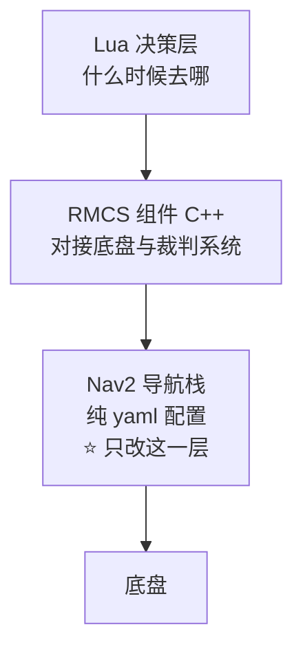

# 导航方向 · 任务规划与操作教程

> 本文是**行动指南**：从零开始，一步步完成《2027赛季算法组培训考核作业细则》§3 导航方向。
> 技术细节与论证见 [导航方向.md](导航方向.md)。
>
> 阅读顺序建议：先通读 §1（认知准备），再按 §3 的阶段逐阶段推进。

---

## 1. 认知准备：先理解这四件事

动手前必须搞懂这四点，否则容易白折腾。

### 1.1 三层结构，只改最下面那层



| 层 | 要改吗 |
|---|---|
| Lua 决策（`src/lua/`） | ❌ |
| RMCS 组件（`src/cxx/`） | ❌ |
| **Nav2 配置（`config/`）** | ✅ **只改这里** |

### 1.2 全局 vs 局部，只换全局

| | 全局规划器 | 局部规划器（MPPI） |
|---|---|---|
| 频率 | **1 Hz** | **20 Hz** |
| 任务 | 看地图规划"大概怎么走" | 看眼前避障 + 跟踪 |
| 要改吗 | ✅ **就是它** | ❌ 已为全向底盘调好 |

**类比**：全局规划器像"出门前看导航定路线"，局部规划器像"开车时打方向盘躲障碍"。

### 1.3 "地图"有两层含义

| 种类 | 位置 | 形式 | 相关吗 |
|---|---|---|---|
| **① Nav2 栅格地图** | `maps/*.png` + `*.yaml` | 像素图 | ✅ 给规划器 |
| ② Lua 路径点模型 | `src/lua/map/*.lua` | **代码** | ❌ 给决策层 |

> `train.lua` 属第 ② 类，是代码不是图片。

### 1.4 你要交付什么

| 交付物 | 内容 | 位置 |
|---|---|---|
| 代码改动 | `motion.yaml` 换规划器 + 调参 | fork 的 `rmcs-navigation` |
| 文档 | 本文 + [导航方向.md](导航方向.md) | 作业仓 |
| 演示 | 基线 vs 新规划器的录屏/截图 | 汇报时展示 |
| 口头 | 为什么选它 / 差异 / 调参思路 | 汇报时讲 |

---

## 2. 环境准备

### 2.1 目录地图：我在哪、改哪个

```
/workspaces/RMCS/                      ← 容器内唯一项目目录（容器名 LIGEON）
│
├─ docs/zh-cn/算法组考核/               ★ 本文件夹（作业文档）
│
├─ rmcs_ws/                            ROS2 工作空间
│   ├─ build/ install/ log/            编译产物（别手动改）
│   └─ src/
│       ├─ rmcs_core/  rmcs_bringup/ … 官方框架（基本不动）
│       └─ rmcs-navigation-deps/       导航依赖栈（第三方）
│           ├─ rmcs-navigation/        ★★★ 主战场
│           │   ├─ config/motion.yaml      ★ 你改的参数
│           │   ├─ config/motion.xml       行为树
│           │   ├─ launch/static.launch.yaml  ★ 实验台
│           │   ├─ maps/                   场地地图
│           │   └─ src/                    ❌ 不要动
│           ├─ rmcs-local-map/         局部地图（不动）
│           ├─ rmcs-localization/      定位（不动）
│           ├─ point-lio/              里程计（不动）
│           └─ livox-ros-driver2/ 等   雷达驱动（不动）
│
└─ rmcs_motor_demo/  navigation_ws/ …   往期作业
```

### 2.2 环境前提（已具备，核对用）

| 项 | 状态 |
|---|---|
| 导航依赖栈 | ✅ 已拉取（6 子模块） |
| `nav2-mppi-controller` | ✅ 已安装 |
| `py-trees` | ✅ 已安装 |
| CMake ≥ 3.30 | ✅ `/opt/cmake/bin/cmake`（4.2.3） |
| GitHub 走 SSH | ✅ 已配置 `insteadOf` |
| 规划器插件 | ✅ `navfn` / `theta_star` / `smac` 均已安装 |

### 2.3 构建与启动（注意别踩坑）

```bash
# 构建（三个要点：bash -lc 包一层、PATH 加 /opt/cmake、用 colcon 而非 build-rmcs）
bash -lc 'export PATH=/opt/cmake/bin:$PATH && cd /workspaces/RMCS/rmcs_ws \
  && source /opt/ros/jazzy/setup.bash && source install/setup.bash \
  && colcon build --packages-up-to rmcs-navigation --symlink-install'

# 启动静态导航栈（无需 C 板、无需雷达）
bash -lc 'cd /workspaces/RMCS/rmcs_ws && source install/setup.bash \
  && ros2 launch rmcs-navigation static.launch.yaml'
```

**四个必踩的坑**（详见 [导航方向.md](导航方向.md) §6.3）：

| 坑 | 一句话解决 |
|---|---|
| zsh 下 `source /opt/ros/jazzy/setup.bash` 静默失效 | 用 `bash -lc '...'` 包一层 |
| 系统 CMake 3.28 太旧 | `export PATH=/opt/cmake/bin:$PATH` |
| `build-rmcs` 的 `--merge-install` 冲突 | 改用 `colcon build` |
| 父仓库 pin 的版本编译不过 | 已切到上游 `main` |

---

## 3. 分阶段执行计划

五个阶段，**每个阶段有明确的验收标准**，不达标不要往下走。

### 阶段 0：理解与确认（0.5 天）

| 项 | 内容 |
|---|---|
| **目标** | 确认基线、搞清改哪里 |
| **操作** | ① 读 [导航方向.md](导航方向.md) 全文<br>② **问组长**：基线确认 + 是否允许用上游 `main`（见下） |
| **验收** | 能回答：现在用什么规划器？我要改成什么？改哪个文件？ |

> ⚠️ **必须问组长的问题**（两件事）：
> 1. `rmcs-navigation-deps` pin 的 `d57fa1c` **编译不过**，我改用上游 `main`，可以吗？
>    （建议同时反馈"父仓库子模块指针该更新了"）
> 2. 细则说"地图会给出"——但现在仓库里已有 `rmuc-v2.png` 等多张地图，
>    以哪张为最终验收场地？

### 阶段 1：跑通实验台（0.5 天）

| 项 | 内容 |
|---|---|
| **目标** | 无机器人跑起导航栈，建立信心 |
| **操作** | ① 按 §2.3 构建<br>② 启动 `static.launch.yaml`<br>③ 另开终端检查 |
| **验收** | 4 节点全 `active`，且能查到规划器类名 |

```bash
# 检查清单
bash -lc 'cd /workspaces/RMCS/rmcs_ws && source install/setup.bash && \
  ros2 node list | sort'
# 期望看到：/bt_navigator  /planner_server  /controller_server  /global_map

bash -lc 'cd /workspaces/RMCS/rmcs_ws && source install/setup.bash && \
  for n in planner_server controller_server bt_navigator global_map; do \
    printf "%-20s %s\n" "$n" "$(ros2 lifecycle get /$n | head -1)"; done'
# 期望：4 个都是 active [3]

bash -lc 'cd /workspaces/RMCS/rmcs_ws && source install/setup.bash && \
  ros2 param get /planner_server GridBased.plugin'
# 期望：nav2_navfn_planner::NavfnPlanner   ← 基线确认
```

### 阶段 2：体检地图与参数（0.5 天）

| 项 | 内容 |
|---|---|
| **目标** | 找出可能"堵死/无解"的地方，为调参定方向 |
| **操作** | ① 打开 `maps/rmuc-v2.png`，目测量最窄通道几格宽<br>② 核对全局/局部 footprint 不一致问题 |
| **验收** | 能判断 0.5 m 膨胀是否会堵死门洞 |

**背景数字**（记住这组数）：

| 量 | 值 | 换算成格（0.1 m/格） |
|---|---|---|
| 地图分辨率 | 0.1 m/px | 1 格 |
| 车宽（局部 footprint） | 0.495 m | ≈ 5 格 |
| `inflation_radius` | 0.5 m | 5 格 |
| 全局 footprint | 0.2 m | 2 格 ⚠️ 与局部差 2.5 倍 |

> **判据**：如果最窄通道宽度 ≤（车宽 + 2×膨胀），规划器就有无解风险。
> 0.495 + 2×0.5 = 1.495 m —— **任何窄于 1.5 m 的通道都危险**。

### 阶段 3：换规划器（0.5 天）

| 项 | 内容 |
|---|---|
| **目标** | 换成 `SmacPlanner2D` 并确认生效 |
| **操作** | ① 改 `config/motion.yaml`（见下）<br>② 重新构建<br>③ 重启并确认 |
| **验收** | `ros2 param get` 输出 `SmacPlanner2D` |

> ⚠️ **换插件必须改 yaml + 重启**，`ros2 param set` 改不了插件类名（启动时确定）。

```bash
# 备份原配置（便于回退做对比）
cd /workspaces/RMCS/rmcs_ws/src/rmcs-navigation-deps/rmcs-navigation
cp config/motion.yaml config/motion.yaml.navfn-baseline

# 改 GridBased 段（只改这一段）
```

```yaml
GridBased:
  plugin: "nav2_smac_planner::SmacPlanner2D"   # ← 只改这一行
  tolerance: 0.5
  allow_unknown: true
  use_final_approach_orientation: false
  # Smac2D 专属参数（先给保守初值，后面再调）
  max_iterations: 1000000
  max_on_approach_iterations: 1000
  cost_penalty: 2.0
  downsampling_factor: 2
  smoother:
    max_iterations: 1000
    w_smooth: 0.3
    w_data: 0.2
    tolerance: 1.0e-10
```

```bash
# 重新构建 + 重启后验证
bash -lc 'export PATH=/opt/cmake/bin:$PATH && cd /workspaces/RMCS/rmcs_ws \
  && source install/setup.bash && colcon build --packages-select rmcs-navigation --symlink-install'

bash -lc 'cd /workspaces/RMCS/rmcs_ws && source install/setup.bash \
  && ros2 param get /planner_server GridBased.plugin'
# 期望：nav2_smac_planner::SmacPlanner2D
```

### 阶段 4：调参消除卡顿（1~2 天，核心）

| 项 | 内容 |
|---|---|
| **目标** | 达到"无明显卡顿" |
| **操作** | 按表顺序，**一次只改一个** |
| **验收** | `/plan` 频率稳定 + `/cmd_vel` 无明显抖动 |

**调参顺序**（从粗到细）：

| 顺序 | 参数 | 现值 | 作用 | 调过头 |
|---|---|---|---|---|
| 1 | `inflation_radius` | 0.5 | 安全圈大小 | **门洞堵死** |
| 2 | `cost_scaling_factor` | 0.5 | 代价衰减 | 过小→贴墙 |
| 3 | `cost_penalty` | 2.0 | 障碍代价权重 | 过大→绕远 |
| 4 | `downsampling_factor` | 2 | 降采样倍数 | 过大→路径糙 |
| 5 | `tolerance` | 0.5 | 终点偏差 | 过小→无解 |
| 6 | `smoother.w_smooth`/`w_data` | 0.3/0.2 | 平滑度 | `w_data` 过小→撞障碍 |
| 7 | 重规划频率（`motion.xml`） | 1.0 Hz | 重规划频率 | 过高→卡顿 |

**每次改动都要记录**（验收 3 的素材）：

```
改动: inflation_radius 0.5 -> 0.35
原因: 0.5 m 在 0.1 m 栅格上占 5 格, 狗洞被膨胀堵死, 规划失败
现象: 规划成功率恢复; /plan 输出恢复稳定
结论: 保留 0.35
```

**数值参数可在线试**（不用重编译）：

```bash
ros2 param set /planner_server GridBased.tolerance 0.2
ros2 param get /planner_server GridBased.tolerance     # 回读确认
```
试出满意值后，**再落回 `motion.yaml`** 形成提交。

### 阶段 5：跨场验证与交付（1 天）

| 项 | 内容 |
|---|---|
| **目标** | 跑通跨场 + 提交留痕 |
| **操作** | ① 静态栈验证规划连通性<br>② 实机跨场（如有条件）<br>③ 提交流程 |
| **验收** | 门洞可通行、起伏路段可规划到对面；fork 上有 commit |

```bash
# 提交到自己的 fork
cd /workspaces/RMCS/rmcs_ws/src/rmcs-navigation-deps/rmcs-navigation
git add config/motion.yaml
git commit -m "feat(nav): 全局规划器由 NavFn 切换为 SmacPlanner2D

选型理由: 内置路径平滑解决折线转折降速; 多分辨率降采样提升大地图规划速度;
cost_penalty 显式障碍代价使路径走通道中间。
调参: cost_penalty 2.0->4.0, downsampling_factor 2->4, inflation_radius 0.5->0.35"
git push          # → origin = 自己的 fork
```

---

## 4. 命令速查

### 4.1 构建 / 启动

```bash
# 构建导航包（含依赖）
bash -lc 'export PATH=/opt/cmake/bin:$PATH && cd /workspaces/RMCS/rmcs_ws \
  && source /opt/ros/jazzy/setup.bash && source install/setup.bash \
  && colcon build --packages-up-to rmcs-navigation --symlink-install'

# 只构建导航包（依赖已构建过时）
bash -lc 'export PATH=/opt/cmake/bin:$PATH && cd /workspaces/RMCS/rmcs_ws \
  && source install/setup.bash && colcon build --packages-select rmcs-navigation --symlink-install'

# 静态栈（无机器人）
bash -lc 'cd /workspaces/RMCS/rmcs_ws && source install/setup.bash \
  && ros2 launch rmcs-navigation static.launch.yaml'

# 换地图
bash -lc 'cd /workspaces/RMCS/rmcs_ws && source install/setup.bash \
  && ros2 launch rmcs-navigation static.launch.yaml global_map:=战队'

# 清理残留进程（导航进程容易变僵尸）
bash -lc 'pkill -f "ros2 launch rmcs-navigation"; pkill -f nav2_ ; sleep 1; echo done'
```

### 4.2 检查

```bash
# 节点列表
bash -lc 'cd /workspaces/RMCS/rmcs_ws && source install/setup.bash && ros2 node list'

# 生命周期
bash -lc 'cd /workspaces/RMCS/rmcs_ws && source install/setup.bash && \
  for n in planner_server controller_server bt_navigator global_map; do \
    printf "%-20s %s\n" "$n" "$(ros2 lifecycle get /$n | head -1)"; done'

# 当前规划器
bash -lc 'cd /workspaces/RMCS/rmcs_ws && source install/setup.bash && \
  ros2 param get /planner_server GridBased.plugin'

# 规划输出频率（"无卡顿"的客观证据）
bash -lc 'cd /workspaces/RMCS/rmcs_ws && source install/setup.bash && \
  ros2 topic hz /plan'

# 全局代价地图尺寸（排查"图被覆盖"）
bash -lc 'cd /workspaces/RMCS/rmcs_ws && source install/setup.bash && \
  ros2 topic echo /global_costmap/costmap --once | head -12'
```

### 4.3 在线调参

```bash
bash -lc 'cd /workspaces/RMCS/rmcs_ws && source install/setup.bash && \
  ros2 param set /planner_server GridBased.cost_penalty 4.0 && \
  ros2 param get /planner_server GridBased.cost_penalty'
```

### 4.4 观测

```bash
# Foxglove 桥（static.launch 已自带，如需单独起）
ros2 run foxglove_bridge foxglove_bridge --ros-args -p port:=8765
# 浏览器连 ws://localhost:8765，看 /plan、/global_costmap、/local_costmap、/cmd_vel
```

---

## 5. 检查清单

### 5.1 动手前

- [ ] 能答：改哪一层？（Nav2 配置层）
- [ ] 能答：全局还是局部？（全局，1 Hz）
- [ ] 能答：`static.launch.yaml` 干什么用？（无机器人跑导航栈）
- [ ] 能答：为什么不用 Hybrid？（全向底盘无转弯半径限制）
- [ ] 能答：改动提交到哪？（自己 fork 的 `rmcs-navigation`）

### 5.2 交付前

- [ ] 实验台 4 节点全 `active`
- [ ] 基线（NavFn）已跑通并录屏
- [ ] `SmacPlanner2D` 已切换并确认生效
- [ ] 调参记录表完整（每次改动 → 现象 → 结论）
- [ ] `/plan` 频率稳定的证据（截图/日志）
- [ ] 门洞可通行、跨场可规划
- [ ] fork 上有 commit 且已 push
- [ ] 三句话能讲：**为什么选它 / 和 NavFn 差在哪 / 调参怎么想的**

---

## 6. 汇报要点（验收三问）

| 验收问题 | 怎么答 |
|---|---|
| **为什么挑这个规划器？和现有差异？** | 一句话：*选 Smac2D 因为它内置路径平滑 + 多分辨率降采样 + 显式障碍代价，正好治 NavFn 的折线转折降速和单分辨率全图慢。* 展开讲三点（见 [导航方向.md](导航方向.md) §4.3） |
| **效果演示 + 代码提交** | 放"NavFn 基线 vs Smac2D"的对比录屏；指 fork 的 commit |
| **调参思路？** | ① 先判断卡顿类型（规划慢 or 跟随抖）→ ② 按从粗到细顺序，一次一个 → ③ 每步记录现象。举 1~2 个具体例子（如"膨胀 0.5 堵死狗洞，降到 0.35 后恢复"） |

---

## 7. 时间预算（参考）

| 阶段 | 内容 | 估时 |
|---|---|---|
| 0 | 理解与确认（含问组长） | 0.5 天 |
| 1 | 跑通实验台 | 0.5 天 |
| 2 | 体检地图与参数 | 0.5 天 |
| 3 | 换规划器 | 0.5 天 |
| 4 | **调参消除卡顿** | **1~2 天** |
| 5 | 跨场验证与交付 | 1 天 |
| | **合计** | **约 4~5 天** |

> 阶段 4 是核心也是唯一可能反复的环节，留足时间。
