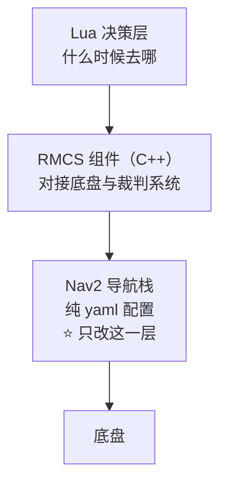

# 导航方向 · 全局规划器选型与调参

> 作业：《2027赛季算法组培训考核作业细则》**§3 导航方向**
> 状态标注：✅ 已实测确认 · ⏳ 待验证
> 行动指南见 [任务规划.md](任务规划.md)

---

## 一、任务与验收

### 1.1 细则原文

| 项 | 内容 |
|---|---|
| **目标** | 使用 `rmcs-navigation-deps` 控制哨兵，挑选一个全局规划器（**不能用现在的 NavfnPlanner**），做到在实际场地的**跨场导航** |
| **要求 1** | 要切换全局规划器，地图会给出 |
| **要求 2** | 独立完成，通过调整规划器参数，实现导航过程中**无明显卡顿** |
| **验收 1** | 讲讲**为什么挑选这个规划器**，它和我们现有规划器的差异 |
| **验收 2** | 效果演示，代码提交 GitHub |
| **验收 3** | 讲讲在实际调试过程中的**调参思路** |

### 1.2 拆解成工程动作

| 细则说的 | 实际要做的事 | 主要工作量 |
|---|---|---|
| 挑选一个全局规划器 | 在 `motion.yaml` 里换一个插件类名 | 很小 |
| 调参实现无明显卡顿 | 调 5~8 个数值参数 | **主要在这** |
| 实际场地跨场导航 | 整张场地图上跑通跨场 | 需要地图与实车 |
| 讲选型理由 / 差异 / 调参思路 | 把过程讲清楚 | 需要能自圆其说 |

> **本质是"配置工程 + 参数整定 + 表达"，不是写算法。**

---

## 二、基线确认：现在的规划器确实是 NavfnPlanner

### 2.1 结论

细则表述**正确**，"现在的规划器"就是 `nav2_navfn_planner::NavfnPlanner`：

```yaml
# rmcs-navigation/config/motion.yaml
planner_server:
  ros__parameters:
    planner_plugins: ["GridBased"]
    GridBased:
      plugin: "nav2_navfn_planner::NavfnPlanner"   # ← 现在的规划器
      tolerance: 0.5
      use_astar: true
      allow_unknown: true
      use_final_approach_orientation: false
```

运行时实测：

```bash
$ ros2 param get /planner_server GridBased.plugin
String value is: nav2_navfn_planner::NavfnPlanner
```

### 2.2 一次误判的教训

第一次拉取时，父仓库 `rmcs-navigation-deps` pin 的子模块是 **`d57fa1c`（2026-05-22）**，
那个版本里规划器是 `ThetaStarPlanner`，一度让人以为"细则过时了"。实际是 **pin 的版本太旧**。

查历史可见规划器被主动改回过 NavFn：

```
$ git log -p d57fa1c..main -- config/motion.yaml | grep -E '^[+-].*plugin:'
commit 3663d5f  wip: localization api, refactor impl and adjust nav2 config
-      plugin: "nav2_theta_star_planner::ThetaStarPlanner"
+      plugin: "nav2_navfn_planner::NavfnPlanner"
```

| commit | 日期 | 规划器 | 说明 |
|---|---|---|---|
| `d57fa1c` | 2026-05-22 | ThetaStar | 父仓库 pin 的版本，**且缺 `rmcs_description` 依赖声明，编译不过** |
| `3663d5f` | — | → NavFn | 主动改回 |
| `632962c`（main） | 2026-08-11 | **NavFn** | 上游最新，含依赖修复 |

**教训**：判断"现在用什么"要以**上游最新分支**为准，不能只看父仓库 pin 的 commit。

### 2.3 工作基线取上游 main

工作分支基于 **上游 `main`（`632962c`）**，而非父仓库 pin 的 `d57fa1c`：

1. `d57fa1c` **缺 `<depend>rmcs_description</depend>`，根本编译不过**：
   ```
   fatal error: rmcs_description/sentry_description.hpp: No such file or directory
   ```
   `main` 的 `632962c` 提交正是 "fix: declare rmcs_description dependency"。
2. 细则所指的 NavFn 只存在于 `main` 上。

> ⚠️ **需向组长报备**：未沿用 `rmcs-navigation-deps` 默认 pin 的版本，因为那个版本无法构建。
> 建议同时反馈"父仓库的子模块指针该更新了"。

---

## 三、系统理解

### 3.1 三层结构



| 层 | 语言 | 职责 | 是否要改 |
|---|---|---|---|
| Lua 决策 | Lua | 决定"现在去哪"（巡逻点、跨场、回防） | ❌ |
| RMCS 组件 | C++ | 把导航与底盘/裁判系统接起来 | ❌ |
| **Nav2 栈** | **yaml 配置** | **规划路径、跟踪路径** | ✅ **只改这里** |

### 3.2 全局 vs 局部分工


| | 全局规划器 | 局部规划器（MPPI） |
|---|---|---|
| 频率 | **1 Hz**（行为树锁死） | **20 Hz** |
| 任务 | 看地图规划"大概怎么走" | 看眼前避障 + 跟踪 |
| 视野 | 整张地图（29.2 × 16.1 m） | 眼前 16 × 16 m |
| 输出 | 一条路径 | 速度指令 |

> **本项目只换全局规划器。** MPPI 局部规划器已为全向底盘调好
> （各向同性 `vx_std == vy_std == 0.55`），不要动。

### 3.3 关键文件

| 文件 | 作用 |
|---|---|
| `rmcs-navigation/config/motion.yaml` | **规划器 + 代价地图 + MPPI 参数（主战场）** |
| `rmcs-navigation/config/motion.xml` | 行为树（重规划频率、恢复链） |
| `rmcs-navigation/launch/static.launch.yaml` | **纯软件测试入口（无机器人）** |
| `rmcs-navigation/maps/*.png/.yaml` | 场地栅格地图 |
| `rmcs-navigation/doc/adjustment-navigation.md` | 前人调参复盘（必读） |
| `rmcs_bringup/config/navigation_test.yaml` | RMCS 侧接入点 |

### 3.4 "地图"有两层含义（易混）

| 种类 | 位置 | 形式 | 给谁用 |
|---|---|---|---|
| **① Nav2 栅格地图** | `maps/*.png` + `*.yaml` | 像素图（黑=障碍） | **代价地图/规划器**（本次相关） |
| **② Lua 路径点模型** | `src/lua/map/*.lua` | 节点+边+边任务的**代码** | Lua 决策层（去哪） |

> `src/lua/map/train.lua` 属第 ② 类，是**代码不是图片**，与规划器调参无关。

### 3.5 Nav2 栅格地图清单

| 文件 | 像素 | 分辨率 | 覆盖 | 引用情况 |
|---|---|---|---|---|
| **`rmuc-v2.png`** ← `rmuc.yaml` | 292×161 | 0.1 m/px | 29.2 × 16.1 m | ✅ **默认使用** |
| `rmuc-v3.png` | 292×161 | — | 同尺寸 | ⚠️ 孤儿（无 yaml 引用） |
| `rmuc.png` | 292×161 | — | 同尺寸 | ⚠️ 孤儿（最老版本，缺中部四个六边形障碍） |
| `rmul.png` ← `rmul.yaml` | 240×160 | 0.05 m/px | 12.0 × 8.0 m | RMUL 场地 |
| `战队.png` ← `战队.yaml` | 343×110 | 0.1 m/px | 34.3 × 11.0 m | 实扫风格（带噪点） |
| `empty.png` ← `empty.yaml` | 2000×2000 | 0.05 m/px | 100 × 100 m | 局部地图 mock 用 |

逐像素比对：`rmuc-v2` vs `rmuc-v3` 仅差 **0.80%**（同一张图的两次修订）；
`rmuc.png` 与前两者差约 3%（结构不同）。

**选中机制**：启动参数 `global_map` → `maps/<名字>.yaml` → yaml 的 `image:` 字段

| 启动文件 | `global_map` 默认 | 实际加载 |
|---|---|---|
| `static.launch.yaml` | `rmuc` | → `rmuc-v2.png` |
| `sensor.launch.yaml` | `empty` | → `empty.png`（真机靠局部地图感知障碍） |
| `recall.launch.yaml` | `empty` | → `empty.png` |

**换地图不用改文件**：

```bash
ros2 launch rmcs-navigation static.launch.yaml global_map:=战队
```

### 3.6 关键参数现状（main 实测）

| 项 | 值 | 位置 |
|---|---|---|
| 全局规划器 | `NavfnPlanner`，`tolerance: 0.5`，`use_astar: true` | `motion.yaml` |
| 全局代价地图分辨率 | 未显式指定（继承地图 0.1 m） | `motion.yaml` |
| 全局 `footprint` | `[[0.1, 0.1], …, [-0.1, 0.1]]`（**0.2 m 见方**） | `motion.yaml` |
| 全局膨胀 | `inflation_radius: 0.5` / `cost_scaling_factor: 0.5` | `motion.yaml` |
| 局部代价地图 | 16 × 16 m，`resolution: 0.04`，rolling window | `motion.yaml` |
| 局部 `footprint` | `[[0.2475, …]]`（**0.495 m 见方**） | `motion.yaml` |
| 局部膨胀 | `inflation_radius: 0.5` / `cost_scaling_factor: 0.5` | `motion.yaml` |
| 局部规划器 | `MPPIController`，`motion_model: Omni` | `motion.yaml` |
| 全局重规划频率 | `RateController hz="1.0"` | `motion.xml` |
| 目标容差 | `xy_goal_tolerance: 0.1` | `motion.yaml` |

> ⚠️ **两处值得注意的不一致**（调参切入点）：
> 1. **全局与局部 footprint 不一致**：全局 0.2 m 见方，局部 0.495 m 见方。
>    底盘的真实 footprint 由"斜边 0.7 m"换算为 0.2475（见 `doc/adjustment-navigation.md` §6），
>    `0.1` 更像占位值。全局图偏小会让**全局路径过于贴近障碍**。
> 2. **膨胀 0.5 m 相对 0.1 m 地图偏大**：0.5 m 只占 5 格，
>    而车宽 0.495 m 也占约 5 格，窄门洞（"狗洞"）有**膨胀堵死导致无解**的风险。

---

## 四、规划器选型

### 4.1 候选对比

| 规划器 | 原理 | 优点 | 缺点 |
|---|---|---|---|
| `NavfnPlanner`（**现状=基线**） | 代价地图上 Dijkstra/A\* 势场搜索，单分辨率全图 | 稳、老牌、行为可预测 | ① 输出格子级折线、**无平滑**，转折多，跟踪时反复降速；② 搜索时视机器人为**质点**，安全裕度全靠膨胀；③ 单分辨率全图搜索，大地图耗时明显 |
| `ThetaStarPlanner`（曾用过，`3663d5f` 换回） | A\* + 视线检测，可走任意角度 | 路径短、直、转折少 | **无内置平滑器**；安全裕度靠膨胀硬撑 |
| **`SmacPlanner2D`** ⭐ | A\* + **多分辨率降采样** + 显式障碍代价 + **内置平滑器** | 路径平滑；搜索快；可调项多 | 需要调 smoother；栅格粗时路径偏糙 |
| `SmacPlannerHybrid` | 2D + Dubin/Reeds-Shepp 运动学 | 满足最小转弯半径 | 哨兵为全向底盘，**不需要**；参数多易无解 |
| `SmacPlannerLattice` | 状态格 + 运动基元 | 最贴运动学 | 配置最复杂，新手不宜 |

### 4.2 选型决策过程

```
5 个候选
  ↓ 排除"细则禁用"的 NavFn
剩 4 个
  ↓ 排除需要运动学模型的（哨兵是全向底盘，无转弯半径限制）→ Hybrid、Lattice
剩 2 个：ThetaStarPlanner、SmacPlanner2D
  ↓ 对比：Smac2D 有内置平滑器 + 多分辨率降采样，正治"卡顿"
结论：SmacPlanner2D
```

### 4.3 选型结论与理由

**选 `nav2_smac_planner::SmacPlanner2D`。**

三条理由（验收 1 的答案）：

1. **内置路径平滑器**（`smoother`）。NavFn 输出格子级折线，每个转折点附近速度几乎掉到 0，跟踪起来就是"一格一格顿"；Smac2D 自带平滑，无需自写后处理。**这是"无明显卡顿"最直接的一层。**
2. **多分辨率降采样**（`downsampling_factor`）：先在粗网格搜、再细化，大地图上比 NavFn 的单分辨率全图搜索快得多。**这是第二层。**
3. **显式障碍代价**（`cost_penalty`）在搜索时把"离障碍远近"折算进 f，把路径更有力地推到通道中间，实车不必频繁避障微调。

> **一句话版本**：*选 Smac2D，因为它内置路径平滑 + 多分辨率加速 + 显式障碍代价，
> 同时解决 NavFn 折线转折导致的反复降速和单分辨率全图搜索的耗时。*

⏳ 待验证：`SmacPlanner2D` 在 0.1 m 粗栅格 + 0.5 m 膨胀下，窄门洞是否仍可通行。

---

## 五、调参方案

### 5.1 先判断"卡顿"是哪一种

| 卡顿类型 | 现象 | 根因 | 测量 |
|---|---|---|---|
| **规划卡顿** | 走到一半停住几秒再走 | 全局规划慢，`/plan` 迟迟不出 | `ros2 topic hz /plan` 看有无空档 |
| **跟踪卡顿** | 一直在走但"一顿一顿" | 路径折线，转折处反复降速 | Foxglove 看 `/cmd_vel` 速度曲线 |

**必须先判断是哪一种**，否则会瞎调。

```bash
ros2 topic hz /plan
ros2 param get /planner_server GridBased.plugin    # 确认参数真生效
```

> 前人踩过的坑：`doc/adjustment-navigation.md` 明确写着"远端联调必须流程化，
> 否则很容易被『假生效』误导"。调完参数一定回读确认。

### 5.2 调参顺序：从粗到细，一次只动一个

| 顺序 | 参数 | 现值 | 作用 | 调过头的现象 |
|---|---|---|---|---|
| 1 | `inflation_radius` | **0.5** | 障碍周围安全圈大小 | **门洞堵死 → 规划失败** |
| 2 | `cost_scaling_factor` | **0.5** | 代价衰减快慢 | 调小→路径贴墙 |
| 3 | `cost_penalty`（Smac2D） | — | 障碍代价权重 | 过大→绕远 |
| 4 | `downsampling_factor`（Smac2D） | — | 降采样倍数 | 过大→路径粗糙 |
| 5 | `tolerance` | **0.5** | 终点允许偏差 | 过小→终点附近无解 |
| 6 | `smoother.w_smooth` / `w_data` | — | 平滑度 / 贴合原始路径 | `w_data` 过小→平滑到撞障碍 |
| 7 | 行为树重规划频率 | **1.0 Hz** | 重规划频率 | 过高→频繁重规划＝明显卡顿 |

### 5.3 调参记录模板（验收 3 要的就是这个）

```
改动: inflation_radius 0.5 -> 0.35
原因: 0.5 m 在 0.1 m 栅格上占 5 格, RMUC 狗洞被膨胀堵死, 规划失败
现象: 规划成功率恢复; /plan 输出恢复稳定
结论: 保留 0.35
```

### 5.4 关键概念：代价地图

Nav2 的代价地图不是 0/1 两态，而是 **0~254** 多级：

| 代价 | 含义 |
|---|---|
| `254` | 致命（lethal）——真实障碍 |
| `253` | 内切（inscribed）——机器人中心到这必撞 |
| 1~252 | 膨胀区——离障碍越近代价越高 |
| `0` | 完全自由 |

衰减公式（$k$ = `cost_scaling_factor`）：

$$\text{cost}(d) = 253 \cdot e^{-k \cdot d}$$

**意义**：$f = g + h$ 中，走通道中间（代价 0）比贴墙（代价 200）f 更小，
算法自动偏好通道中间 —— 这正是"让 f 有区分度"的手段。

---

## 六、验证方法

### 6.1 无需机器人的静态测试（实验台）✅

`rmcs-navigation/launch/static.launch.yaml` 专为纯软件联调设计，
**不需要任何真实传感器/里程计/SLAM**。

启动内容：mock `local_map`（`empty.yaml`）、`global_map`、静态 TF（`world→odom→base_link`）、
`motion.launch.yaml` 全部导航节点、`foxglove_bridge`。

**不启动**：传感器驱动、SLAM/定位、`rmcs_local_map`、`point_lio`。

```bash
# 构建（必须用 /opt/cmake 的 CMake ≥ 3.30）
bash -lc 'export PATH=/opt/cmake/bin:$PATH && cd /workspaces/RMCS/rmcs_ws \
  && source /opt/ros/jazzy/setup.bash && source install/setup.bash \
  && colcon build --packages-up-to rmcs-navigation --symlink-install'

# 启动静态导航栈（不需要 C 板、不需要雷达）
bash -lc 'cd /workspaces/RMCS/rmcs_ws && source install/setup.bash \
  && ros2 launch rmcs-navigation static.launch.yaml'
```

实测结果（4 个节点全部 `active`）：

```
/bt_navigator          active [3]
/planner_server        active [3]
/controller_server     active [3]
/global_map            active [3]
```

**价值**：
1. 不用等机器人即可验证规划器切换是否生效；
2. 可**在线改数值参数**观察效果，无需反复重编译：
   ```bash
   ros2 param set /planner_server GridBased.tolerance 0.2
   ros2 param get /planner_server GridBased.plugin
   ```
   ⚠️ 但"加载哪个插件类名"在进程启动时确定，**换插件必须改 yaml + 重启**；
   `ros2 param set` 只适合调**数值型**参数。
3. 配 Foxglove 可直接看到 `/plan`、代价地图，是"无卡顿"判据的来源。

### 6.2 完整链路（接机器人）

```bash
ros2 launch rmcs_bringup rmcs.launch.py robot:=navigation_test
```

观测：Foxglove 连 `ws://localhost:8765`。

### 6.3 环境踩坑（均实测）

| 坑 | 现象 | 解决 |
|---|---|---|
| **zsh 下 source ROS setup 失效** | `source /opt/ros/jazzy/setup.bash` 报 `no such file: .../rmcs_ws/setup.sh` | 该脚本用 `BASH_SOURCE[0]` 定位自身，zsh 下为空。**用 `bash -lc '...'` 包一层** |
| **CMake 版本太旧** | `CMake 3.30 or higher is required. You are running version 3.28.3` | 用 `/opt/cmake/bin`（4.2.3）：`export PATH=/opt/cmake/bin:$PATH` |
| **`build-rmcs` 与现有 install 冲突** | `install directory was created with the layout 'isolated'` | 该脚本用 `--merge-install`，与现有 isolated 布局不兼容；直接用 `colcon build` |
| **父仓库 pin 的版本编译不过** | `rmcs_description/sentry_description.hpp: No such file or directory` | 见 §2.3，切到上游 `main` |

---

## 七、留痕与提交

### 7.1 改动位置

改动文件在 `rmcs-navigation` **子模块**内，不在作业仓库里，故分两处：

| 位置 | 内容 |
|---|---|
| fork `gebilaowuxiaoyu123/rmcs-navigation`，分支 `feat/smac-global-planner` | 规划器相关改动（`config/motion.yaml` 等） |
| `RMCS_Test`（作业仓 `main`） | 本文档 + [任务规划.md](任务规划.md) |

### 7.2 子模块 remote 约定

| remote | 指向 | 用途 |
|---|---|---|
| `origin` | `gebilaowuxiaoyu123/rmcs-navigation`（自己的 fork） | `git push` 默认去这里 |
| `upstream` | `Alliance-Algorithm/rmcs-navigation`（官方） | 只用于 `git fetch` 拉更新 |

```bash
cd rmcs_ws/src/rmcs-navigation-deps/rmcs-navigation
git checkout feat/smac-global-planner
# 改完 config/motion.yaml 后
git add config/motion.yaml
git commit -m "feat(nav): ..."
git push          # → origin，即自己的 fork
```

### 7.3 网络注意

本机 **GitHub HTTPS 直连超时，必须走 SSH**（已配置）：

```bash
git config --global url."git@github.com:".insteadOf "https://github.com/"
```

---

## 八、待办与风险

### 8.1 待办

- [x] 确认基线：现在的规划器就是 `NavfnPlanner`（细则表述正确）
- [x] 拉取依赖（`rmcs-navigation-deps` + 6 个子模块）
- [x] 确认地图可用（`rmuc-v2.png`）
- [x] fork `rmcs-navigation`，推送分支 `feat/smac-global-planner`（基于上游 `main`）
- [x] 补齐运行时依赖（`nav2-mppi-controller`、`py-trees`）
- [x] 构建通过，静态测试栈 4 节点全 `active`
- [ ] **向组长报备**：未沿用父仓库 pin 的 `d57fa1c`（编译不过），改用上游 `main`
- [ ] 用**当前规划器**（NavFn）跑通一次并录屏（基线）
- [ ] 切换 `SmacPlanner2D`，编译、跑通、录屏（对比素材）
- [ ] 按 §5.2 顺序调参，逐条记录现象
- [ ] 确认 `/plan` 频率稳定（"无卡顿"的客观证据）
- [ ] 跨场验证：门洞可通行、起伏路段能规划到对面
- [ ] 补齐本文档的真实数据与对比截图
- [ ] 准备三句话：**为什么选它 / 和现有规划器差在哪 / 调参怎么想的**

### 8.2 已知风险

| 风险 | 说明 | 应对 |
|---|---|---|
| **父仓库 pin 的版本过旧且编译不过** | `rmcs-navigation-deps` pin 的是 5 月的 `d57fa1c`（ThetaStar + 缺依赖声明），上游 `main` 已是 8 月版 | 已切 `main`；建议反馈"父仓库子模块指针该更新" |
| 与 `rmcs-navigation-deps` 默认不一致 | 我们的基线是上游 `main`，不是默认 pin 的 commit | 报备组长，说明 pin 的版本无法构建 |
| **膨胀 0.5 m 可能堵死窄门洞** | 0.1 m 栅格下 0.5 m 只占 5 格，车宽也占约 5 格 | 优先体检狗洞宽度；必要时降膨胀 |
| **全局/局部 footprint 不一致** | 全局 0.2 m 见方 vs 局部 0.495 m 见方 | 确认真实 footprint，统一后再调膨胀 |
| 地图偏粗 | 292×161 px @ 0.1 m | 窄道精度有限；必要时提高分辨率 |
| 磁盘紧张 | 根分区剩余约 16 GB | 全量 `colcon build` 前留意空间 |
| 静态测试的局限 | mock 的 `local_map` 是空图，无真实障碍与噪声；**验证不了跟随质量** | 静态栈只能验证"规划链路 + 参数加载 + 规划速度"，跟随效果仍需实机 |
| 无实车 | 调参最终要实机 | 先用静态栈验证，落盘前需实机确认 |
