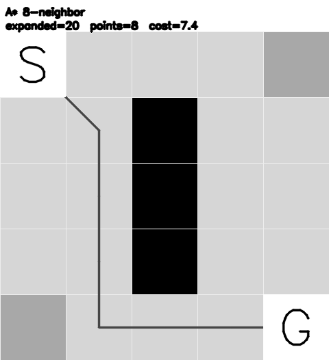
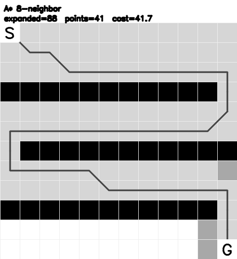
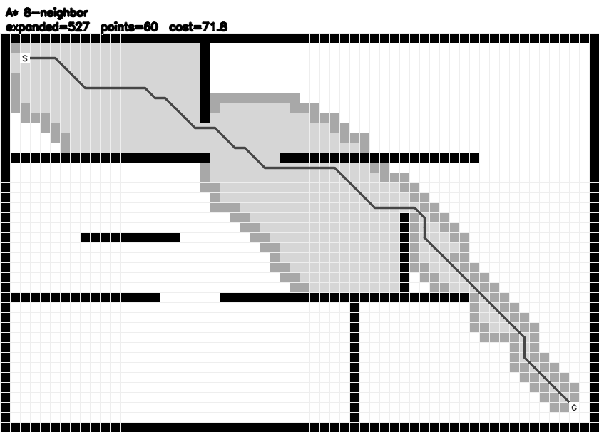
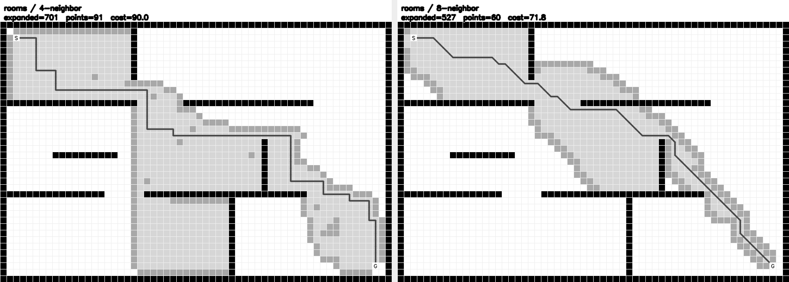

# 任务四 · A* 寻路

## 一、怎么跑

```bash
cd /workspaces/RMCS/navigation_ws/task4
cmake -S . -B build        # 配置，第一次（或改了 CMakeLists）才需要
cmake --build build -j8    # 编译
./build/task4_astar        # 运行
```

**不带参数**，地图我都写在代码里了。跑完 `output/` 下有 5 张图：

```
tiny_5x5.png        5×5 最小地图
regular_12x12.png   12×12 规则地图（三道错开的墙，绕 S 形走）
rooms.png           60×40 房间地图（墙 + 门洞）
random.png          60×40 随机障碍地图
neighbors.png       同一张图 4 邻域 vs 8 邻域对比
```

代码就 3 个文件，各管各的：

```
task4/
├── include/map.hpp      地图：图多大、哪格能走、怎么造墙
├── include/astar.hpp    算法：怎么找路（接口和实现都在这一个文件里）
└── src/main.cpp         主程序：造地图 + 调算法 + 画图
```

要改地图就改 `src/main.cpp` 的 `make_maps()`：

```cpp
Map tiny(5, 5);                    // 建一张 5×5 的图
tiny.fill_wall(2, 1, 1, 3);        // 从 (2,1) 开始画一道 1×3 的竖墙
maps.push_back(Case{"tiny_5x5", std::move(tiny), Point{0, 0}, Point{4, 4}});
//                 ↑名字                        ↑起点      ↑终点
```

**图是黑白的**（灰度，没有彩色）：白=空地、黑=障碍、浅灰=搜过的格子、中灰=待办清单、深灰=最后那条路径；起点写个 `S`，终点写个 `G`，标题和结果数字放在图上方单独一条白边上，不压着地图。

## 二、代码

### include/map.hpp

```cpp
#pragma once

#include <cstddef>
#include <random>
#include <vector>

// 一个格子坐标
struct Point {
    int x = 0;
    int y = 0;

    bool operator==(const Point& other) const { return x == other.x && y == other.y; }
};

// 一张栅格地图。cells 里 0 是空地、1 是墙，按行存成一维数组
class Map {
public:
    Map(int w, int h)
        : width(w)
        , height(h)
        , cells(static_cast<std::size_t>(w) * static_cast<std::size_t>(h), 0) {}

    // 坐标在不在图里
    bool inside(int x, int y) const { return x >= 0 && y >= 0 && x < width && y < height; }

    // 这一格能不能走（在界内 且 不是墙）
    bool free(int x, int y) const { return inside(x, y) && cells[index(x, y)] == 0; }

    // 二维坐标转成一维下标
    int index(int x, int y) const { return y * width + x; }

    void set_wall(int x, int y) {
        if (inside(x, y))
            cells[index(x, y)] = 1;
    }

    void clear_wall(int x, int y) {
        if (inside(x, y))
            cells[index(x, y)] = 0;
    }

    // 从 (x,y) 开始铺一块 w×h 的墙
    void fill_wall(int x, int y, int w, int h) {
        for (int j = y; j < y + h; ++j)
            for (int i = x; i < x + w; ++i)
                set_wall(i, j);
    }

    // 从 (x,y) 开始清出一块 w×h 的空地
    void clear_area(int x, int y, int w, int h) {
        for (int j = y; j < y + h; ++j)
            for (int i = x; i < x + w; ++i)
                clear_wall(i, j);
    }

    // 沿四周糊一圈墙
    void add_border() {
        fill_wall(0, 0, width, 1);
        fill_wall(0, height - 1, width, 1);
        fill_wall(0, 0, 1, height);
        fill_wall(width - 1, 0, 1, height);
    }

    // 按比例随机撒墙，seed 固定所以每次跑出来一样
    void random_walls(double ratio, unsigned seed) {
        std::mt19937 generator(seed);
        std::bernoulli_distribution distribution(ratio);
        for (auto& cell : cells)
            cell = distribution(generator) ? 1 : 0;
    }

    int width;
    int height;
    std::vector<unsigned char> cells;
};
```

### include/astar.hpp

```cpp
#pragma once

#include <algorithm>
#include <cmath>
#include <functional>
#include <queue>
#include <vector>

#include "map.hpp"

// 一次寻路的结果
struct Result {
    bool found = false;                    // 找到没有
    int expanded = 0;                      // 展开了多少格，越小越快
    double cost = 0.0;                     // 路径总代价
    std::vector<Point> path;               // 起点→终点的路径
    std::vector<unsigned char> visited;    // 每格状态：0 没碰过 / 1 在待办里 / 2 已展开
};

// allowDiagonal 为 true 就是 8 邻域（能斜走），false 就只能上下左右
inline Result find_path(const Map& map, Point start, Point goal, bool allowDiagonal) {
    const double INF = 1e18;                    // 代表"还没到过"
    const double ROOT2 = 1.4142135623730951;    // 斜走一步的代价 = 根号2

    // 待办清单里的一项，f 小的先被拿出来展开
    struct Node {
        double f = 0.0;
        double g = 0.0;
        int x = 0;
        int y = 0;

        bool operator>(const Node& other) const { return f > other.f; }
    };

    // 启发函数：估"从 (x,y) 到终点还剩多远"。这个值不能高估，否则 A* 就不保证最优了
    const auto heuristic = [goal, allowDiagonal, ROOT2](int x, int y) {
        const double distX = std::abs(x - goal.x);
        const double distY = std::abs(y - goal.y);

        // 只能上下左右走：曼哈顿距离，在这个走法下刚好不高估
        if (!allowDiagonal)
            return distX + distY;

        // 能斜走：先尽量斜走（一步根号2），剩下不够斜的再直走（一步 1）
        return std::max(distX, distY) + (ROOT2 - 1.0) * std::min(distX, distY);
    };

    Result result;
    result.visited.assign(map.cells.size(), 0);

    // g[i] = 从起点走到第 i 格目前找到的最小代价，初始都是无穷大
    std::vector<double> g(map.cells.size(), INF);
    // from[i] = 第 i 格是从哪一格走过来的，最后靠它回推整条路径
    std::vector<int> from(map.cells.size(), -1);
    // 小顶堆当待办清单，f 最小的先出队
    std::priority_queue<Node, std::vector<Node>, std::greater<Node>> open;

    const int startIndex = map.index(start.x, start.y);
    g[startIndex] = 0.0;
    open.push(Node{heuristic(start.x, start.y), 0.0, start.x, start.y});
    result.visited[startIndex] = 1;

    // 八个方向：前 4 个是上下左右，后 4 个是四个斜角
    const int dirX[8] = {1, -1, 0, 0, 1, 1, -1, -1};
    const int dirY[8] = {0, 0, 1, -1, 1, -1, 1, -1};

    while (!open.empty()) {
        const Node now = open.top();
        open.pop();

        const int nowIndex = map.index(now.x, now.y);

        // 同一格可能被改进多次、在堆里躺了好几份。这份的 g 比记录里的大，
        // 说明是过期数据，直接跳过。比从堆里精确删元素简单得多
        if (now.g > g[nowIndex])
            continue;

        result.visited[nowIndex] = 2;   // 标记成"已展开"
        ++result.expanded;

        // 拿出来的正好是终点，收工
        if (now.x == goal.x && now.y == goal.y) {
            result.found = true;
            break;
        }

        // 不允许斜走时只看前 4 个方向
        const int count = allowDiagonal ? 8 : 4;
        for (int i = 0; i < count; ++i) {
            const int nextX = now.x + dirX[i];
            const int nextY = now.y + dirY[i];
            if (!map.free(nextX, nextY))    // 出界或撞墙
                continue;

            // 斜走时还要看会不会从两个障碍的缝里穿过去（穿墙角不合法）
            const bool diagonal = dirX[i] != 0 && dirY[i] != 0;
            if (diagonal && (!map.free(now.x + dirX[i], now.y) || !map.free(now.x, now.y + dirY[i])))
                continue;

            // 从当前格走到这一格，一共要花多少
            const double step = now.g + (diagonal ? ROOT2 : 1.0);
            const int nextIndex = map.index(nextX, nextY);
            if (step >= g[nextIndex])       // 不比已知的更好，就不用更新
                continue;

            g[nextIndex] = step;
            from[nextIndex] = nowIndex;
            result.visited[nextIndex] = 1;
            open.push(Node{step + heuristic(nextX, nextY), step, nextX, nextY});
        }
    }

    // 找到就顺着 from 从终点往回走，走完翻转过来就是"起点→终点"
    if (result.found) {
        const int goalIndex = map.index(goal.x, goal.y);
        result.cost = g[goalIndex];

        int index = goalIndex;
        while (index != -1) {
            result.path.push_back(Point{index % map.width, index / map.width});
            index = from[index];
        }
        std::reverse(result.path.begin(), result.path.end());
    }

    return result;
}
```

`src/main.cpp` 就干三件事：造地图、调 `find_path`、把结果画成 PNG。画图每格用 `cv::rectangle` 填一种灰度，路径用 `cv::polylines` 连成折线，起点终点格子填白后写上 `S` / `G`，最后把标题和数字写在上方那条 46 像素的白边上。

## 三、结果

四张地图我都跑了，全部找到路径：

| 地图 | 尺寸 | 展开格数 | 路径点数 | 路径代价 |
|---|---|---|---|---|
| tiny_5x5 | 5×5 | 20 | 8 | 7.4 |
| regular_12x12 | 12×12 | 88 | 41 | 41.7 |
| rooms | 60×40 | 527 | 60 | 71.8 |
| random | 60×40 | 612 | 69 | 77.9 |

**5×5 最小地图**：中间竖着一道 1×3 的墙，起点在左上角、终点在右下角，路径得绕过去。代价 7.4，就是 1 步斜走（1.41）加 6 步直走。



**12×12 规则地图**：三道墙错开（右边留口、左边留口、右边留口），所以路径是个 S 形。



**60×40 房间地图**：墙把地图切成几个房间，得绕门洞走。浅灰是搜过的格子，中灰是待办清单贴着障碍的那层边。



## 四、顺带验证的一件事

同一张 rooms 地图，我只改了"准不准斜走"一个开关：



| 配置 | 展开格数 | 路径点数 | 路径代价 |
|---|---|---|---|
| 4 邻域（只能上下左右） | 701 | 91 | 90.0 |
| 8 邻域（可斜走） | 527 | 60 | 71.8 |

这次两边一比，**8 邻域是又快又短**：展开的格子少了四分之一，代价从 90 降到 71.8，少了 20%。

4 邻域那个 90 也对得上——从 (2,2) 到 (57,37) 横竖各要走 55+35=90 步，一步代价 1，所以就是 90。8 邻域能斜走，路径点数从 91 掉到 60，也不再是一格一格的锯齿了。所以能斜走就让它斜走。

另外踩了两个坑：一是斜走会穿墙（就是代码里那段 `diagonal` 判断），二是同一个格子会在优先队列里躺好几份（我用 `if (now.g > g[nowIndex]) continue;` 跳过过期数据）。
