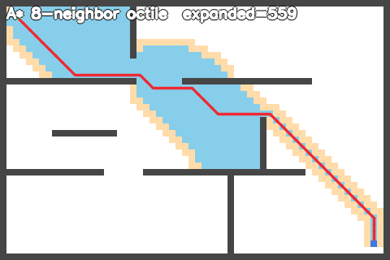
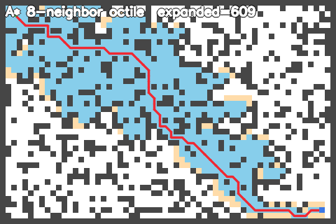
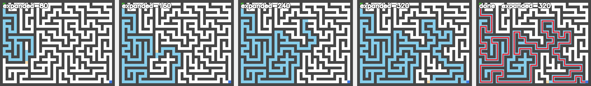
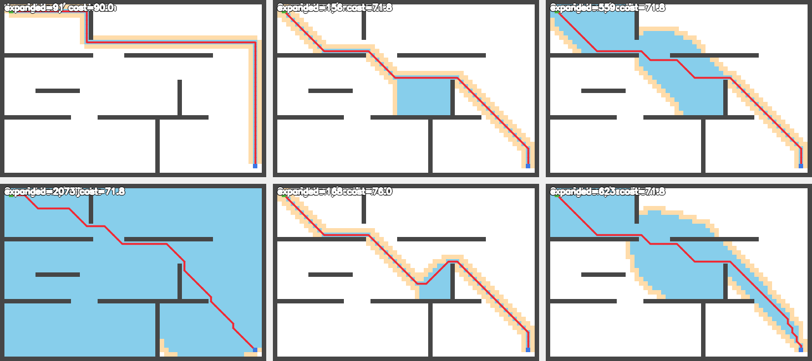

# 任务四 · A* 寻路

## 一、目录与环境

```
navigation_ws/
├── Hybrid_Astar_for_Navigation/   ← 参考模板（floatpigeon 的 Hybrid A* 项目）
└── task4/
    ├── CMakeLists.txt
    ├── include/grid_map.hpp, astar.hpp
    ├── src/grid_map.cpp, astar.cpp, main.cpp
    └── output/                    ← 结果图
```

- 参考模板是 `github.com/floatpigeon/Hybrid_Astar_for_Navigation`，用 `git clone --depth 1` 拉的。
- 它用的也是 OpenCV 做可视化，而且能在窗口里用鼠标点起终点（Ctrl+左键设起点、Shift+左键设终点、回车算路径）。这个交互方式我在无桌面的容器里用不了，所以**借它的思路（地图/节点/算法/绘制分开）**，但改成"地图自动生成 + 结果自动存成 PNG"，这样我能直接把图导出来看。
- 编译要 OpenCV，容器里已经有 4.6.0。

```bash
cd navigation_ws/task4
cmake -S . -B build
cmake --build build -j8
./build/task4_astar
```

## 二、A* 到底在干什么（大白话）

**地图**：一张格子图，每格要么是空地要么是障碍。用小方格而不是连续坐标，是因为格子图上的搜索最好理解也最好实现，点与点之间的连接关系天然就有。

**核心公式**：

$$f(n) = g(n) + h(n)$$

- $g(n)$：从**起点**走到格子 $n$ 已经花掉的实际代价
- $h(n)$：从格子 $n$ 到**终点**大概还要多远（估计值，所以叫"启发函数"）
- $f(n)$：这一格"总的看起来要花多少"

搜索逻辑就三句话：

1. 把起点丢进"待办清单"；
2. 每次从清单里挑 **f 最小**的那格拿出来展开（看它的邻居，算 $g$、$h$、$f$，放进清单）；
3. 直到拿出来的正好是终点，顺着"从哪来的"回推就得到路径。

**为什么这样能找到最短路**：A* 相当于"有方向感的 Dijkstra"。Dijkstra 只看 $g$（已经走了多远），所以像水波一样朝四面八方铺开；A* 多了 $h$，等于在说"我更想往终点那个方向铺"，于是铺得集中得多。只要 $h$ **不高估**真实剩余距离，A* 找到的路径就一定是代价最小的那条。

**关键点：$h$ 不能高估。** 8 邻域移动时，一步斜着走的代价是 $\sqrt2 \approx 1.414$：

| 启发函数 | 公式 | 8 邻域下 | 后果 |
|---|---|---|---|
| 曼哈顿 | $\|dx\|+\|dy\|$ | **高估**（把斜走当 2 步算） | 不再是 A*，退化成贪心：快，但不保证最优 |
| 欧几里得 | $\sqrt{dx^2+dy^2}$ | 低估 | 最优，但展开得多 |
| **Octile** | $\max + (\sqrt2-1)\min$ | **刚好** | 最优，且展开最少——8 邻域应该用它 |
| 零 | 0 | 完全没有方向感 | 就是 Dijkstra |

这就是我下面测出来那组数据的由来。

**代码设计**（对应"注意代码规范和设计"）：

- `GridMap`——只管地图：尺寸、某格能不能走、怎么造地图。不掺和搜索。
- `astar.hpp/cpp`——只管搜索：输入地图 + 起终点 + 参数，输出路径 + 统计 + 中间过程的状态图。不掺和画图。
- `main.cpp`——只管造地图、调用搜索、渲染图片。
- 启发函数做成枚举 + 权重，不用改代码就能对比不同配置。

三层互相不知道对方的实现细节，所以换渲染方式不用动算法，换启发函数不用动地图。

## 三、核心代码

### CMakeLists.txt

```cmake
cmake_minimum_required(VERSION 3.16)
project(task4_astar LANGUAGES CXX)

set(CMAKE_CXX_STANDARD 17)
set(CMAKE_CXX_STANDARD_REQUIRED ON)

if(NOT CMAKE_BUILD_TYPE)
    set(CMAKE_BUILD_TYPE Release)          # 默认 Release，搜索跑得快
endif()

find_package(OpenCV REQUIRED)              # 画图用

add_executable(task4_astar
    src/main.cpp
    src/grid_map.cpp
    src/astar.cpp
)

target_include_directories(task4_astar PRIVATE include ${OpenCV_INCLUDE_DIRS})
target_link_libraries(task4_astar PRIVATE ${OpenCV_LIBS})
```

### include/astar.hpp（算法对外接口）

```cpp
#pragma once

#include <cstddef>
#include <cstdint>
#include <vector>

#include "grid_map.hpp"

namespace nav {

// 可选启发函数。宁可少写，也别多算：枚举能防住拼错字符串的问题
enum class Heuristic { kZero, kManhattan, kEuclidean, kOctile };

// 一次搜索的全部可调参数，集中放一起，调用处只传这一坨
struct AStarOptions {
    bool allow_diagonal = true;              // 允许斜着走（8 邻域）；false 就只剩上下左右
    bool prevent_corner_cutting = true;      // 禁止从两个障碍的夹角里"蹭"过去
    Heuristic heuristic = Heuristic::kOctile;// 用哪个启发函数
    double heuristic_weight = 1.0;           // 加权 A*：>1 搜得更快，但路径可能不是最优
    std::size_t snapshot_interval = 0;       // 每隔多少次展开存一张过程图（0 = 不存）
    std::size_t max_snapshots = 4;           // 过程图最多存几张
};

// 搜索结果的统计量，用来对比不同配置的好坏
struct SearchStats {
    bool found = false;          // 找没找到
    std::size_t expanded = 0;    // 展开了多少格（越小越快）
    std::size_t generated = 0;   // 总共生成了多少候选
    std::size_t path_points = 0; // 路径上有多少格
    double path_cost = 0.0;      // 路径总代价（越小越好）
};

// 一次搜索的完整产出
struct SearchResult {
    std::vector<GridPoint> path;                          // 起点→终点的路径
    std::vector<std::uint8_t> state;                      // 每格状态：0 没碰过 / 1 在待办里 / 2 已展开
    std::vector<std::vector<std::uint8_t>> snapshots;     // 搜索过程的状态快照
    std::vector<std::size_t> snapshot_expanded;           // 每张快照对应的展开次数
    SearchStats stats;
};

// 算单个格子的启发值，单独抽出来方便测试
double heuristic_cost(Heuristic heuristic, GridPoint from, GridPoint to);

// 主搜索。options 给了默认值，所以可以只传前三个参数先用起来
SearchResult astar(
    const GridMap& map, GridPoint start, GridPoint goal, const AStarOptions& options = {});

} // namespace nav
```

### src/astar.cpp（算法本体）

```cpp
#include "astar.hpp"

#include <algorithm>
#include <cmath>
#include <limits>
#include <queue>
#include <stdexcept>

namespace nav {

namespace {

// 用一个足够大的数表示"还没到达过"
constexpr double kInfinity = std::numeric_limits<double>::infinity();
constexpr double kStraightCost = 1.0;              // 直着走一步代价
constexpr double kDiagonalCost = 1.4142135623730951;  // 斜着走一步代价 = 根号2

// 优先队列里存的东西：f 决定谁先被展开，g 用来做"同分时优先展开离终点近的"
struct QueueNode {
    double f = 0.0;
    double g = 0.0;
    int index = -1;      // 格子在一维数组里的下标

    // 小顶堆的比较规则：f 小的排前面；f 相同时 g 大的排前面
    // （g 大说明离终点近，先展开它能更快碰到终点，能省不少无用展开）
    bool operator>(const QueueNode& other) const {
        if (f != other.f)
            return f > other.f;
        return g < other.g;
    }
};

// 斜着走时，检查"会不会从两个障碍的夹角里穿过去"。
// 比如左上和右下都是障碍，人从中间斜穿过去等于穿墙，视觉上也很怪，所以要禁止。
bool diagonal_allowed(
    const GridMap& map, GridPoint from, GridPoint to, bool prevent_corner_cutting) {
    if (!prevent_corner_cutting)
        return true;
    return map.is_free(GridPoint{to.x, from.y}) && map.is_free(GridPoint{from.x, to.y});
}

} // namespace

double heuristic_cost(Heuristic heuristic, GridPoint from, GridPoint to) {
    // 取绝对值，因为"往哪个方向"不重要，重要的是差多远
    const double dx = std::abs(static_cast<double>(to.x - from.x));
    const double dy = std::abs(static_cast<double>(to.y - from.y));

    switch (heuristic) {
    case Heuristic::kZero: return 0.0;                       // 等于 Dijkstra
    case Heuristic::kManhattan: return dx + dy;              // 只适合 4 邻域
    case Heuristic::kEuclidean: return std::sqrt(dx * dx + dy * dy);  // 直线距离
    case Heuristic::kOctile:
        // 8 邻域的标准启发：能斜走就先斜走，剩下的直走
        return kStraightCost * std::max(dx, dy) + (kDiagonalCost - kStraightCost) * std::min(dx, dy);
    }
    return 0.0;
}

SearchResult astar(const GridMap& map, GridPoint start, GridPoint goal, const AStarOptions& options) {
    // 起终点本身就在障碍里的话，直接报错，免得后面算出莫名其妙的结果
    if (!map.is_free(start) || !map.is_free(goal))
        throw std::invalid_argument("起点或终点落在障碍上");

    SearchResult result;
    result.state.assign(map.size(), 0);       // 一开始所有格子都是"没碰过"
    result.snapshots.reserve(options.max_snapshots);

    // g_score[i] = 从起点到第 i 格目前找到的最小代价；初始都是无穷大
    std::vector<double> g_score(map.size(), kInfinity);
    // parent[i] = 第 i 格是从哪一格走过来的，最后靠它回推路径
    std::vector<int> parent(map.size(), -1);

    const int start_index = static_cast<int>(map.index(start));
    const int goal_index = static_cast<int>(map.index(goal));

    // 小顶堆当"待办清单"，f 最小的先出
    std::priority_queue<QueueNode, std::vector<QueueNode>, std::greater<QueueNode>> open;

    // 起点入队：g = 0，f 就是它到终点的估计
    g_score[static_cast<std::size_t>(start_index)] = 0.0;
    open.push(QueueNode{
        options.heuristic_weight * heuristic_cost(options.heuristic, start, goal), 0.0, start_index});
    result.state[static_cast<std::size_t>(start_index)] = 1;   // 标记为"在待办清单里"

    // 8 个方向的偏移量。前 4 个是上下左右，后 4 个是四个斜角
    const int step[8][2] = {{1, 0}, {-1, 0}, {0, 1}, {0, -1}, {1, 1}, {1, -1}, {-1, 1}, {-1, -1}};

    bool found = false;

    while (!open.empty()) {
        const QueueNode current = open.top();
        open.pop();

        const auto current_index = static_cast<std::size_t>(current.index);

        // 惰性删除：同一个格子可能被改进多次、在堆里躺了好几份，
        // 如果这份的 g 已经不是最新的（比记录里的大），说明是过期数据，跳过。
        // 这样比"从堆里删元素"简单得多，代价只是堆稍微大一点。
        if (current.g > g_score[current_index])
            continue;

        result.state[current_index] = 2;      // 标记成"已展开"
        ++result.stats.expanded;

        // 按间隔保存过程快照，方便后面拼成"搜索过程"的连环图
        if (options.snapshot_interval != 0
            && result.stats.expanded % options.snapshot_interval == 0
            && result.snapshots.size() < options.max_snapshots) {
            result.snapshots.push_back(result.state);
            result.snapshot_expanded.push_back(result.stats.expanded);
        }

        // 拿出来的就是终点，收工
        if (current.index == goal_index) {
            found = true;
            break;
        }

        // 一维下标换回二维坐标
        const GridPoint from{
            static_cast<int>(current_index % static_cast<std::size_t>(map.width())),
            static_cast<int>(current_index / static_cast<std::size_t>(map.width()))};

        // 不允许斜走时只看前 4 个方向
        const int neighbour_count = options.allow_diagonal ? 8 : 4;
        for (int i = 0; i < neighbour_count; ++i) {
            const GridPoint to{from.x + step[i][0], from.y + step[i][1]};

            // 障碍或出界，跳过
            if (!map.is_free(to))
                continue;

            // 斜走还要额外检查能不能穿夹角
            const bool diagonal = step[i][0] != 0 && step[i][1] != 0;
            if (diagonal && !diagonal_allowed(map, from, to, options.prevent_corner_cutting))
                continue;

            // 从当前格走到邻居格，一共要花多少
            const double tentative =
                g_score[current_index] + (diagonal ? kDiagonalCost : kStraightCost);

            const auto to_index = map.index(to);

            // 这条路不比已知的更好，那就不用更新
            if (tentative >= g_score[to_index])
                continue;

            // 记录更好的走法
            g_score[to_index] = tentative;
            parent[to_index] = current.index;
            result.state[to_index] = 1;
            ++result.stats.generated;
            open.push(QueueNode{
                tentative + options.heuristic_weight * heuristic_cost(options.heuristic, to, goal),
                tentative, static_cast<int>(to_index)});
        }
    }

    result.stats.found = found;

    // 找到就顺着 parent 从终点往回走，走完翻过来就是"起点→终点"的顺序
    if (found) {
        int index = goal_index;
        while (index != -1) {
            result.path.push_back(GridPoint{index % map.width(), index / map.width()});
            index = parent[static_cast<std::size_t>(index)];
        }
        std::reverse(result.path.begin(), result.path.end());
        result.stats.path_points = result.path.size();
        result.stats.path_cost = g_score[static_cast<std::size_t>(goal_index)];
    }

    return result;
}

} // namespace nav
```

其余两个文件（`grid_map.hpp/cpp` 和 `main.cpp`）分别负责"地图怎么造"和"结果怎么画"，源码都在 `task4/` 里。`main.cpp` 里的渲染就是把每格按状态刷成不同颜色：

- 空地 → 白，障碍 → 深灰
- 已展开（closed）→ 浅蓝，待办里（open / frontier）→ 浅橙
- 最终路径 → 红色折线，起点绿、终点蓝

## 四、测试结果

三张地图都能找到路径：

| 地图 | 尺寸 | 展开格数 | 路径点数 | 路径代价 | 说明 |
|---|---|---|---|---|---|
| random（随机障碍 28%） | 60×40 | 609 | 69 | 77.9 | 障碍散乱，路径要绕来绕去 |
| rooms（房间+门洞） | 60×40 | 559 | 60 | 71.8 | 墙把地图切成几个房间，绕门走 |
| maze（DFS 生成的迷宫） | 41×31 | 320 | 259 | 258.0 | 通道只有一条，路径特别长 |

### 1. rooms 地图的最终结果

浅蓝是搜索过的区域，浅橙是"待办清单"的边缘，红线是最终路径：



### 2. random 地图

障碍更多，可以看到搜索区域明显贴着障碍绕：



### 3. maze 的搜索过程（连环图）

这是我觉得最能说明问题的一张：从左上开始，展开 80 / 160 / 240 次时的探索范围，最后一张是找到路径的结果。能直接看到 A* 是**一层一层往前推**、并且越接近终点探索范围越收窄：



### 4. 换不同启发函数 / 不同走法，差别有多大

同一个 rooms 地图，跑 6 种配置：



| 配置 | 展开格数 | 路径代价 |
|---|---|---|
| 4 邻域 + 曼哈顿 | 91 | 90.0 |
| 8 邻域 + 曼哈顿 | 156 | 71.8 |
| 8 邻域 + 欧几里得 | 623 | 71.8 |
| **8 邻域 + Octile** | **559** | **71.8** |
| 8 邻域 + 零（= Dijkstra） | 2073 | 71.8 |
| 8 邻域 + Octile，权重 3 | 168 | 76.0 |

**从这组数据能读出几件事**：

1. **4 邻域和 8 邻域不能直接比代价**。4 邻域只能上下左右走，从 (2,2) 到 (57,37) 至少 55+35=90 步，代价就是 90；8 邻域能斜走，代价 71.8。这不是"算法谁好"，是"走法本身不一样"。
2. **启发函数越准，展开越少**。同一张图、同一个走法：Dijkstra（没有任何方向感）展开 2073 格，欧几里得 623，Octile 559。启发越贴近真实剩余距离，搜索越"有方向"，铺开的面就越小。
3. **曼哈顿在 8 邻域下反而是"开挂作弊"**。它把斜走当成 2 步算，等于**高估**了剩余距离，于是 A* 从"保证最优"退化成"贪心"——展开只有 156 格、快得离谱，这次运气好碰巧还是最优路径（代价 71.8），但**它已经没有最优性保证了**，换张地图就可能给出更绕的路。这也是为什么"启发函数不能高估"这条规矩很重要。
4. **加权 A\* 是拿最优性换速度**。权重设 3，展开从 559 掉到 168（快 3 倍多），但代价从 71.8 涨到 76.0，多了 5.8%。对"要快、差一点能接受"的场景（比如实时避障）就很划算。

## 五、踩到的坑

**坑一：斜走会"穿墙"。**
最开始没做 corner cutting 检查，路径会从两个斜对角障碍的缝里穿过去——几何上不合法，实际机器人也走不了。加了 `diagonal_allowed()`（要求斜走时两个相邻格都得是空地）之后就正常了。

**坑二：同一个格子会在优先队列里躺好几份。**
发现更好的走法时会重新入队，但旧的那份还在堆里。如果不管，就会重复展开、统计数字也会虚高。做法是"惰性删除"：出队时比一下，如果这份的 $g$ 比记录里的大，就说明是过期数据，直接跳过。比从堆里精确删元素简单得多，代价只是堆稍微大一点。

## 六、和参考模板的关系

`Hybrid_Astar_for_Navigation` 是 Hybrid A*（给车用的，带朝向、不能原地转向），本任务要求的是**栅格 A\***，所以算法是我自己写的，没有照搬它。借的是它的**工程拆分思路**：地图类、节点/算法、绘制分开，别把搜索逻辑和画图混在一起。它的交互式可视化（鼠标点起终点）在无桌面环境跑不了，我换成自动生成地图 + 自动存图。
