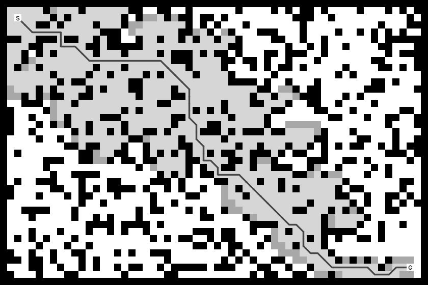

# 任务四 · A* 寻路

## 一、怎么跑

```bash
cd /workspaces/RMCS/navigation_ws/task4
cmake -S . -B build        # 配置，第一次（或改了 CMakeLists）才需要
cmake --build build -j8    # 编译
./build/task4_astar        # 运行
```

**不用给参数**，地图我都写在代码里了。跑完 `output/` 下会有 4 张图：

```
tiny_5x5.png        5×5 最小地图
regular_12x12.png   12×12 规则地图（三道错开的墙，绕 S 形走）
rooms.png           60×40 房间地图（墙 + 门洞）
random.png          60×40 随机障碍地图
```

代码就 3 个文件，都放在 `src/` 下：

```
task4/
└── src/
    ├── map.hpp      地图：图多大、哪格能走、怎么造墙
    ├── astar.hpp    算法：怎么找路
    └── main.cpp     主程序：造地图 + 调算法 + 画图
```

要是想再加一张自己的地图，我想直接在 `main()` 里照葫芦画瓢加一段最省事：

```cpp
Map tiny(5, 5);                 // 建一张 5×5 的图
tiny.fill_wall(2, 1, 1, 3);     // 从 (2,1) 开始画一道 1×3 的竖墙
run(tiny, Point{0, 0}, Point{4, 4}, "tiny_5x5");
//  ↑地图    ↑起点       ↑终点      ↑结果图的名字
```

`run()` 里面就三件事：算一次、在屏幕上打一行结果、存一张 `output/名字.png`。我不太喜欢把一堆东西在 `main()` 里摊开写，收口到一个函数里，主函数看着清爽，改地图也就是改几行造墙而已。

算法我最后还是选了最经典的那种 A*：**4 邻域，只上下左右走，一步一格；h(n) 用曼哈顿距离；每走一步代价算 1**。中间我也犹豫过要不要让它斜着走，斜着走确实路能短一截，但一允许斜走，就得管"能不能从两个障碍的缝里钻过去"这种事，代码立刻多一截；而最经典的 A* 本来就是曼哈顿距离配 4 个方向。我想，任务要的是把最经典的这个写扎实，先别急着堆花样。

图的样子我做成常见的那种格子图：没搜过的空地浅灰，搜过的刷淡黄，还挂在待办清单上的刷稍微深一点的黄，墙接近黑，最后那条路**一格一格涂成绿色**，每格都有浅灰边框。有的图还会在起点终点插小旗子、在障碍上画叉，我觉得那两个不是必须的——起点终点写个 `S`、`G` 就够了，图上不放标题也不放数字，看着干净，数值直接打在终端里。

## 二、代码

名字我就按 A* 里最通用的叫法起的（h(n)、g(n)、f(n)、OpenList、CloseList、Parent 那一套），看代码的时候能直接对上号：

| 通用写法 | 代码里的名字 |
|---|---|
| h(n)、CalcDeltaHValue | `calc_h()` |
| g(n) | `node.g`、`gBest[]`（每格已知最好的 g） |
| f(n) = h(n) + g(n) | `calc_f()` |
| dg(n)、CalcDeltaGValue | 每步 `+ 1.0`（4 邻域一步一格，代价都一样） |
| OpenList | `openList`（一个普通数组） |
| CloseList、Colored 数组 | `colored[]`（0 没碰过 / 1 在 OpenList / 2 在 CloseList） |
| Parent | `parent[]` |
| Hash 函数 `x * Size.Y + y` | `Map::index()` |
| `Search(start, end)` | `search()` |

### src/map.hpp

```cpp
#pragma once

#include <cstdlib>
#include <vector>

// 一个格子的坐标
struct Point {
    int x = 0;
    int y = 0;
};

// 一张格子地图，cells 里 0 是空地、1 是墙
class Map {
public:
    Map(int w, int h) {
        width = w;
        height = h;
        cells = std::vector<unsigned char>(w * h, 0);
    }

    // 坐标在不在图里
    bool inside(int x, int y) const {
        if (x < 0 || y < 0 || x >= width || y >= height)
            return false;
        return true;
    }

    // 这一格能不能走（在界内 并且 不是墙）
    bool free(int x, int y) const {
        if (!inside(x, y))
            return false;
        if (cells[index(x, y)] == 1)
            return false;
        return true;
    }

    // 二维坐标转成一维下标（本质上就是个 hash）：y * width + x
    int index(int x, int y) const {
        return y * width + x;
    }

    void set_wall(int x, int y) {
        if (inside(x, y))
            cells[index(x, y)] = 1;
    }

    void clear_wall(int x, int y) {
        if (inside(x, y))
            cells[index(x, y)] = 0;
    }

    // 从 (x,y) 开始铺一块 w 宽 h 高的墙
    void fill_wall(int x, int y, int w, int h) {
        for (int j = y; j < y + h; j++) {
            for (int i = x; i < x + w; i++) {
                set_wall(i, j);
            }
        }
    }

    // 从 (x,y) 开始清出一块 w 宽 h 高的空地
    void clear_area(int x, int y, int w, int h) {
        for (int j = y; j < y + h; j++) {
            for (int i = x; i < x + w; i++) {
                clear_wall(i, j);
            }
        }
    }

    // 四周糊一圈墙
    void add_border() {
        fill_wall(0, 0, width, 1);
        fill_wall(0, height - 1, width, 1);
        fill_wall(0, 0, 1, height);
        fill_wall(width - 1, 0, 1, height);
    }

    // 按比例随机撒墙，seed 固定所以每次跑出来一样
    void random_walls(double ratio, unsigned seed) {
        srand(seed);
        for (int i = 0; i < width * height; i++) {
            int r = rand() % 100;
            if (r < ratio * 100)
                cells[i] = 1;
            else
                cells[i] = 0;
        }
    }

    int width = 0;
    int height = 0;
    std::vector<unsigned char> cells;
};
```

### src/astar.hpp

```cpp
#pragma once

#include <algorithm>
#include <cmath>
#include <vector>

#include "map.hpp"

// OpenList 里的一个待办点
struct Node {
    int x = 0;
    int y = 0;
    double g = 0.0;    // g(n)：从起点走到这里已经花了多少代价
    double h = 0.0;    // h(n)：估计从这里到终点还要花多少
};

// 一次寻路的结果
struct Result {
    bool found = false;                    // 找到没有
    int expanded = 0;                      // 展开了多少格（也就是 CloseList 的大小）
    double g = 0.0;                        // 终点的 g(n)，也就是整条路的代价
    std::vector<Point> path;               // 起点到终点的路
    std::vector<unsigned char> colored;    // 0 没碰过、1 在 OpenList 里、2 在 CloseList 里
};

// f(n) = g(n) + h(n)
double calc_f(Node node) {
    return node.g + node.h;
}

// h(n) 用曼哈顿距离：横着差多少格 + 竖着差多少格
double calc_h(Node node, Point goal) {
    int dx = std::abs(node.x - goal.x);
    int dy = std::abs(node.y - goal.y);
    return dx + dy;
}

Result search(const Map& map, Point start, Point goal) {
    const double INF = 1e18;    // 代表"还没到过"

    Result result;
    result.colored.assign(map.cells.size(), 0);

    // gBest[i] = 第 i 格目前找到的最好的 g，初始都是无穷大
    std::vector<double> gBest(map.cells.size(), INF);
    // parent[i] = 第 i 格是从哪一格走过来的
    std::vector<int> parent(map.cells.size(), -1);

    // OpenList 就用一个普通数组装着
    std::vector<Node> openList;

    Node startNode;
    startNode.x = start.x;
    startNode.y = start.y;
    startNode.g = 0.0;
    startNode.h = calc_h(startNode, goal);
    openList.push_back(startNode);

    int startIndex = map.index(start.x, start.y);
    gBest[startIndex] = 0.0;
    result.colored[startIndex] = 1;

    // 4 邻域：右、左、下、上
    int dx[4] = {1, -1, 0, 0};
    int dy[4] = {0, 0, 1, -1};

    while (openList.size() > 0) {
        // 从 OpenList 里找出 f 最小的那个
        int best = 0;
        for (int i = 1; i < (int)openList.size(); i++) {
            if (calc_f(openList[i]) < calc_f(openList[best]))
                best = i;
        }

        Node now = openList[best];
        openList.erase(openList.begin() + best);

        int nowIndex = map.index(now.x, now.y);
        result.colored[nowIndex] = 2;    // 放进 CloseList
        result.expanded = result.expanded + 1;

        // 拿出来的正好是终点，结束
        if (now.x == goal.x && now.y == goal.y) {
            result.found = true;
            result.g = now.g;
            break;
        }

        for (int i = 0; i < 4; i++) {
            int nextX = now.x + dx[i];
            int nextY = now.y + dy[i];

            if (!map.free(nextX, nextY))    // 出界或者撞墙
                continue;

            int nextIndex = map.index(nextX, nextY);
            if (result.colored[nextIndex] == 2)    // 已经在 CloseList 里了
                continue;

            // 4 邻域每走一步代价都是 1，所以 g(n) = g(parent) + 1
            double nextG = now.g + 1.0;
            if (nextG >= gBest[nextIndex])    // 不比已经找到的路更短，就不管
                continue;

            gBest[nextIndex] = nextG;
            parent[nextIndex] = nowIndex;

            if (result.colored[nextIndex] == 1) {
                // 这个点已经在 OpenList 里了，把它的 g 和 h 改掉
                for (int j = 0; j < (int)openList.size(); j++) {
                    if (openList[j].x == nextX && openList[j].y == nextY) {
                        openList[j].g = nextG;
                        openList[j].h = calc_h(openList[j], goal);
                        break;
                    }
                }
            } else {
                // 新点，加进 OpenList
                Node child;
                child.x = nextX;
                child.y = nextY;
                child.g = nextG;
                child.h = calc_h(child, goal);
                openList.push_back(child);
                result.colored[nextIndex] = 1;
            }
        }
    }

    // 找到了就顺着 parent 从终点往回想，最后倒过来
    if (result.found) {
        int index = map.index(goal.x, goal.y);
        while (index != -1) {
            Point p;
            p.x = index % map.width;
            p.y = index / map.width;
            result.path.push_back(p);
            index = parent[index];
        }
        std::reverse(result.path.begin(), result.path.end());
    }

    return result;
}
```

`src/main.cpp` 我分成了三块，这样自己回头看也不容易乱：

1. **`draw()`** 负责画图：每格先用 `cv::rectangle` 填底色（看 `colored` 是 2 就淡黄、1 就稍深的黄、是墙就接近黑），然后把路径上的格子整格涂绿，再补一遍网格线，最后把起点终点格子填白、写上 `S` 和 `G`。
2. **`run()`** 把"算一次、打一行、存一张图"包在一起，`main()` 里一张地图调一次就行。
3. **`main()`** 就是一张地图一段，造墙靠 `fill_wall()`，撒随机墙靠 `random_walls()`。看着有点长，但我觉得比塞进一个循环里好懂，加地图也就是复制一段。

数值我不往图上画，在终端里看：

```bash
[tiny_5x5]  找到路径  expanded=22  points=9  g=8
[regular_12x12]  找到路径  expanded=89  points=45  g=44
[rooms]  找到路径  expanded=1071  points=91  g=90
[random]  找到路径  expanded=666  points=91  g=90
```

## 三、结果

| 地图 | 尺寸 | 展开格数 | 路径点数 | 总代价 g |
|---|---|---|---|---|
| tiny_5x5 | 5×5 | 22 | 9 | 8 |
| regular_12x12 | 12×12 | 89 | 45 | 44 |
| rooms | 60×40 | 1071 | 91 | 90 |
| random | 60×40 | 666 | 91 | 90 |

**5×5 最小地图**：中间竖着一道 1×3 的墙，起点在左上、终点在右下。曼哈顿距离就是 8 格，路正好 8 步走完，一步没多绕，这个我觉得可以作为"算法没错"的一个小验证。


**12×12 规则地图**：三道墙错开留口（右边一个口、左边一个口、再右边一个口），只能拐着走。直线过去明明只要 22 步，被墙逼着绕成了 44 步，正好一倍——每次都得钻门再折回来。


**60×40 房间地图**：墙把地图切成几间房，得绕门洞才能穿过去。代价 90 正好等于曼哈顿距离 55+35=90，也就是说虽然绕门，但没有多走冤枉路。图上淡黄是搜过的格子（CloseList），稍深一点的黄是还挂在待办清单上的（OpenList）。


**60×40 随机地图**：墙按 28% 的概率随机撒，seed 我写死成 2026，所以每次跑出来都是同一张，方便对着看。代价也是 90，随机墙里正好留下了一条不绕远的路。



## 四、几个取舍，和踩过的坑

**1）OpenList 我没上优先队列，先用数组。**
我知道优先队列取最小是 O(log n)，比我一轮一轮扫数组快得多。但我对写比较器（给结构体重载运算符、再传 `greater` 那一套）还不熟，写错了还不好查；而我这地图最大也就 60×40，一轮扫两千多次，机器根本不在乎。所以我选了看得懂的写法：普通数组 + 每次从头找 f 最小的。而且已经在 OpenList 里的点我是**直接原地把 g 和 h 改掉**，这样表里同一个格子永远只有一份，不用管什么"过期数据"。我想先这样，真嫌慢了再换，不着急。

**2）CloseList 我没用链表，改成一张涂色的数组。**
地图一大，"查一个点在不在 CloseList 里"就是个很费时间的活——每来一个点都要从头找一遍。所以另开一个和地图一样大的数组，0 是没碰过、1 是在 OpenList 里、2 是进了 CloseList，查一次就是 `colored[map.index(x, y)]`，一步到位。本质上就是个 hash，下标用 `y * width + x` 算出来。

**3）展开格数这个数，我觉得有点虚，不打算拿它吹。**
rooms 那张图展开了 1071 格，可代价只有 90，说明路本来就不长，多出来的那批是"平局"造成的：f 一样的时候我挑的是先加进数组的那个，于是会多确认一批同学。路还是最短的那条，只是多花了点时间确认。以后要是真想让它少展开点，我想有两个方向：一是换成优先队列，二是给平局再定个规矩（比如离终点近的优先）。现在就先这样。

**4）踩过的坑，主要是两个。**
一个是最开始我把路径画成一条细折线，结果在地图一大（60×40）的时候几乎看不见，后来改成整格涂绿，一眼就能看清路径怎么走的。另一个是 `gBest` 这个数组：我一开始想着 Node 里已经有 g 了，何必再记一份，结果同一个格子会被后来的差路反复改写，`parent` 跟着被覆盖，最后回溯出来的路和打印的代价对不上号——所以"每格已知最好的 g"还是得留着。

**5）图的配色也是犹豫过的。**
我一开始做的是很艳的蓝+橙+红，自己看着都吵；后来换成浅灰底 + 淡黄 + 绿色路径，边界用细细的浅灰线，看着就舒服多了，也不影响看数。小旗子和叉我没画，我觉得不是必要的东西，起点终点写 S 和 G 更省事。
