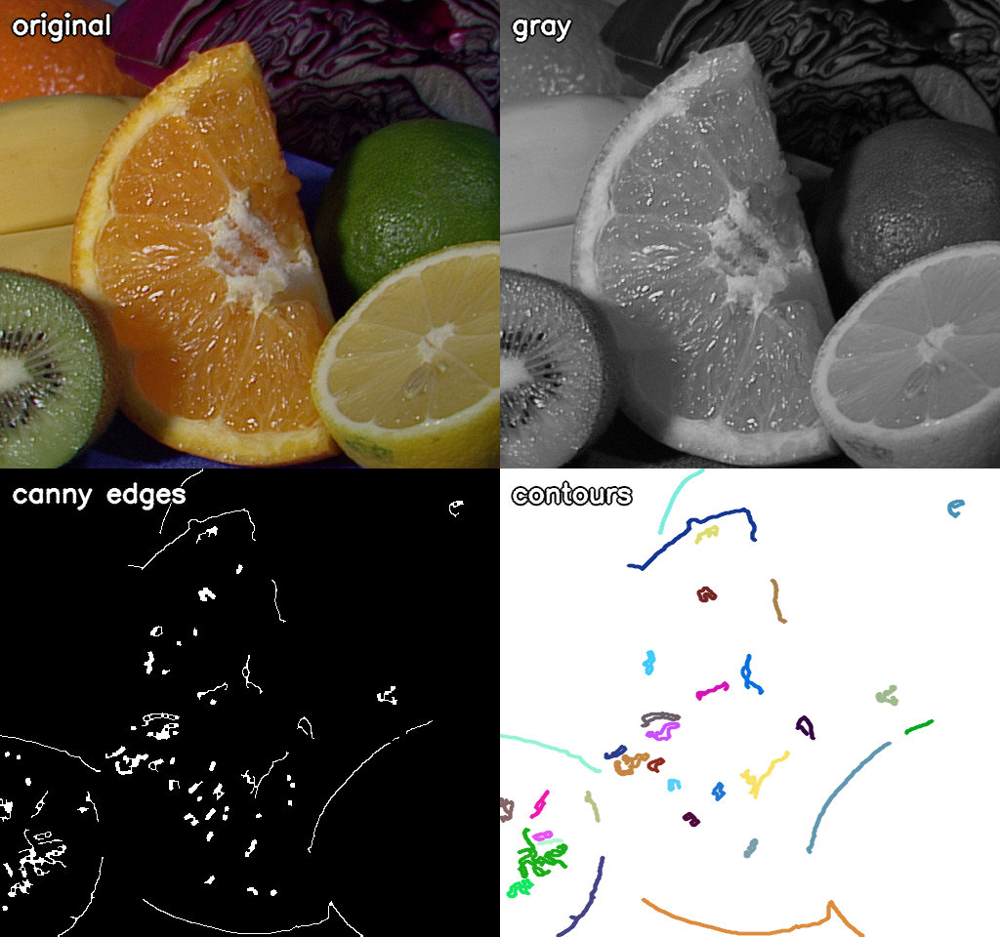
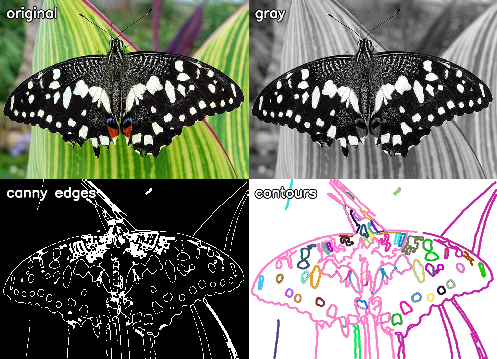
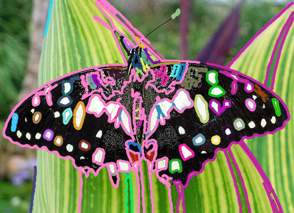
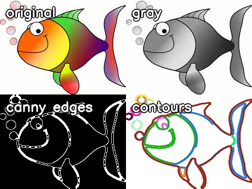
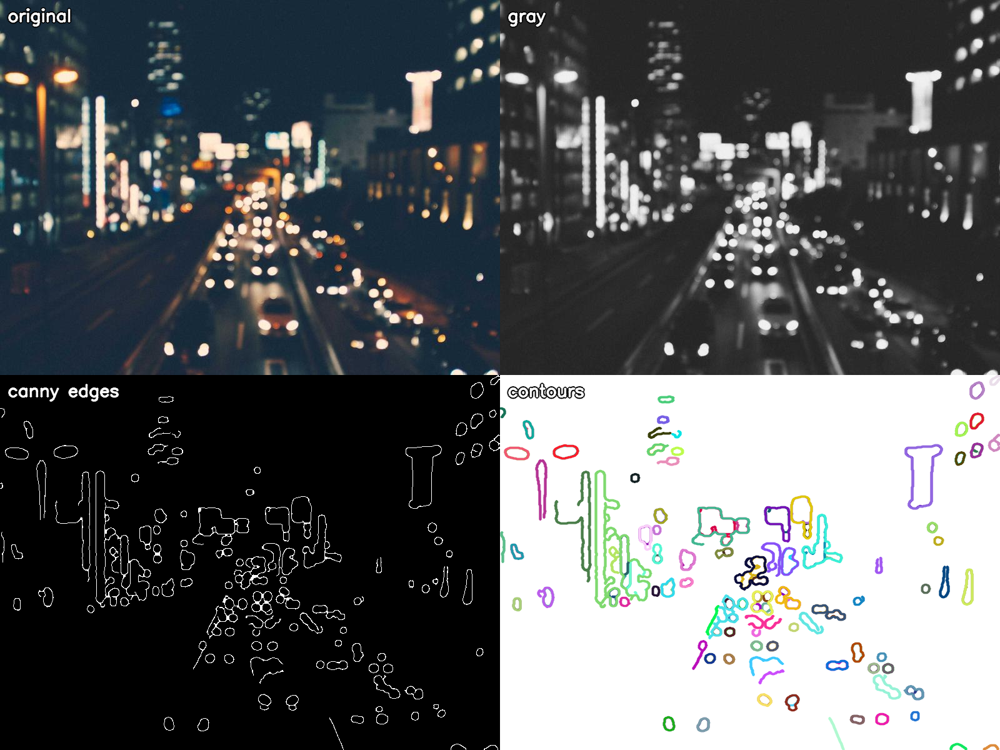

# 任务三 · OpenCV 轮廓检测

## 一、先猜一下：那个网站是怎么做的

> https://lab.magiconch.com/one-last-image/ 能把彩色照片变成双色线稿。

我的猜测，大概分四步：

1. **先提取线条**。照片里"哪里是边"是靠边缘检测算出来的（Canny 这类，或者更讲究的 XDoG / 相位一致性）。这一步输出的是一张"线条掩膜"——只有线，没有颜色。
2. **按线条分布决定颜色**。线稿只有两种颜色（粉、蓝），所以还要有个规则决定哪条线上哪个色：常见的做法是看线条所在的区域（比如原图这块是亮是暗、在上半还是下半），或者按连通的线条走向分块。
3. **线条浓淡保留原图信息**。深色/细节多的地方线条更密，亮的地方留白多——所以它并不是"纯描边"，而是保留了明暗层次，很可能是边缘检测 + 阈值/抖动的组合，不是随便描一圈。
4. **最后合成**。把双色线条叠在背景色上，有时再叠一点纸纹/噪点做手绘感。

一句话：**边缘检测拿到线，再用一套上色规则把线分成两色，最后合成**。核心还是边缘检测，和我下面写的轮廓检测是同一类思路。

## 二、目录与环境

```
opencv_ws/
├── opencv/              ← OpenCV 官方仓库（4.x 分支）
└── task3/
    ├── CMakeLists.txt
    ├── src/contour_detect.cpp
    ├── images/          ← 测试图
    └── output/          ← 结果图
```

- **OpenCV 源码**：从官方仓库拉的，命令是 `git clone --depth 1 --branch 4.x git@github.com:opencv/opencv.git opencv`（`--depth 1` 只取最新一次提交，省时间省空间）。
- **编译用的库**：容器里其实已经装好了 OpenCV 4.6.0（`/usr/include/opencv4`），所以 `find_package(OpenCV)` 直接就能找到，不用再从源码编一遍。

**测试图**：5 张彩色图。`butterfly.jpg`、`fruits.jpg`、`HappyFish.jpg` 取自 OpenCV 官方仓库自带的样例图；`web_1.jpg`、`web_2.jpg` 是从网上 (picsum.photos) 下的，其中 `web_1` 太暗（是逆光的窗户）后面没再用。

编译运行：

```bash
cd opencv_ws/task3
cmake -S . -B build
cmake --build build -j8
./build/contour_detect images/fruits.jpg output/fruits 40
#                        ↑图片          ↑输出前缀     ↑最小周长
```

## 三、思路（大白话）

```
彩色图 ──灰度──► 灰图 ──高斯模糊──► 去噪 ──Canny──► 边缘图
                                                      │
                                                      ▼
                                           findContours 把边缘连成一条条轮廓
                                                      │
                                                      ▼
                                           drawContours 给每条轮廓刷上不同颜色
```

几个关键点：

- **为什么要先灰度**：Canny 只认亮度变化，不认颜色，灰度化既省算力也更稳。
- **为什么要高斯模糊**：照片有噪点，噪点也是"边缘"，不模糊的话会检出满屏碎线。模糊把高频噪声抹掉，只留下真正明显的边界。
- **为什么用 Canny**：它比单纯的"阈值二值化"好，因为双阈值机制——强边缘直接保留、弱边缘只有连着强边缘才保留。所以它能把真实轮廓连起来，同时把噪点丢掉。
- **为什么筛选看"周长"而不是"面积"**：这一点我一开始做错了。Canny 出来的轮廓大多是**细长的一圈线**，它围起来的面积可能很小，但线本身很长。所以用面积筛会把有用的线全滤掉，应该用 `arcLength`（周长）筛。

## 四、代码

### CMakeLists.txt

```cmake
cmake_minimum_required(VERSION 3.16)
project(task3_contour LANGUAGES CXX)          # 项目名，语言用 C++

set(CMAKE_CXX_STANDARD 17)                    # 用 C++17
set(CMAKE_CXX_STANDARD_REQUIRED ON)

if(NOT CMAKE_BUILD_TYPE)
    set(CMAKE_BUILD_TYPE Release)             # 默认 Release，跑图像处理快很多
endif()

find_package(OpenCV REQUIRED)                 # 找系统里的 OpenCV

message(STATUS "OpenCV version: ${OpenCV_VERSION}")
message(STATUS "OpenCV include: ${OpenCV_INCLUDE_DIRS}")

add_executable(contour_detect src/contour_detect.cpp)
target_include_directories(contour_detect PRIVATE ${OpenCV_INCLUDE_DIRS})   # 头文件路径
target_link_libraries(contour_detect PRIVATE ${OpenCV_LIBS})                # 链接库
```

### src/contour_detect.cpp

```cpp
// 任务三：对彩色图片做轮廓检测并绘制。
// 整体流程：读图 → 灰度 → 高斯模糊 → Canny 边缘 → findContours 找轮廓 → drawContours 画轮廓。
// 用法：./contour_detect <图片> <输出前缀> <最小周长>

#include <cstdlib>      // std::atof
#include <iostream>     // std::cout
#include <string>
#include <vector>

#include <opencv2/imgcodecs.hpp>    // imread / imwrite：读写图片
#include <opencv2/imgproc.hpp>      // cvtColor / GaussianBlur / Canny / findContours / drawContours

namespace {

// 把单通道（灰度）图转成三通道 BGR。
// 原因：后面要把灰度图、边缘图和彩色图拼在一个面板里，通道数必须一致。
cv::Mat to_bgr(const cv::Mat& image) {
    cv::Mat out;
    if (image.channels() == 1)
        cv::cvtColor(image, out, cv::COLOR_GRAY2BGR);
    else
        out = image.clone();
    return out;
}

// 在图片左上角写一行标签。
// 先描一层粗黑边、再写白字，这样不管底色是亮是暗都看得清。
void put_label(cv::Mat& image, const std::string& text) {
    const cv::Point origin{12, 34};
    cv::putText(
        image, text, origin, cv::FONT_HERSHEY_SIMPLEX, 0.9, cv::Scalar(0, 0, 0), 5, cv::LINE_AA);
    cv::putText(
        image, text, origin, cv::FONT_HERSHEY_SIMPLEX, 0.9, cv::Scalar(255, 255, 255), 2,
        cv::LINE_AA);
}

// 把轮廓逐条画到画布上，每条换一个颜色，方便区分。
// 注意第一行：cv::Mat 的拷贝是"浅拷贝"（共用同一块像素内存），
// 不 clone 的话 drawContours 会直接把轮廓画进原图，把原图数据改掉。
cv::Mat draw_contours_on(cv::Mat canvas, const std::vector<std::vector<cv::Point>>& contours) {
    canvas = canvas.clone();
    for (std::size_t i = 0; i < contours.size(); ++i) {
        // 用下标乘不同系数再取模，凑出一组区分度还行的伪随机颜色
        const int blue = static_cast<int>((i * 37 + 60) % 256);
        const int green = static_cast<int>((i * 91 + 140) % 256);
        const int red = static_cast<int>((i * 53 + 220) % 256);
        cv::drawContours(
            canvas, contours, static_cast<int>(i), cv::Scalar(blue, green, red), 2, cv::LINE_AA);
    }
    return canvas;
}

// 把四张图拼成 2x2 面板：左上、右上、左下、右下。
cv::Mat stack_panel(
    const cv::Mat& top_left, const cv::Mat& top_right, const cv::Mat& bottom_left,
    const cv::Mat& bottom_right) {
    cv::Mat top, bottom, panel;
    cv::hconcat(top_left, top_right, top);      // 横向拼
    cv::hconcat(bottom_left, bottom_right, bottom);
    cv::vconcat(top, bottom, panel);            // 纵向拼
    return panel;
}

} // namespace

int main(int argc, char** argv) {
    // 三个命令行参数，都有默认值，直接 ./contour_detect 也能跑
    const std::string input_path = argc > 1 ? argv[1] : "images/fruits.jpg";
    const std::string output_prefix = argc > 2 ? argv[2] : "output/result";
    const double min_length = argc > 3 ? std::atof(argv[3]) : 40.0;

    // 读图。第二个参数 IMREAD_COLOR 强制读成三通道彩色图
    const cv::Mat image = cv::imread(input_path, cv::IMREAD_COLOR);
    if (image.empty()) {
        std::cerr << "无法读取图片: " << input_path << '\n';
        return 1;
    }

    // 1) 灰度化：边缘检测只关心亮度变化
    cv::Mat gray;
    cv::cvtColor(image, gray, cv::COLOR_BGR2GRAY);

    // 2) 高斯模糊：5x5 的核，sigma 1.5。抹掉噪点，避免检出满屏碎线
    cv::Mat blurred;
    cv::GaussianBlur(gray, blurred, cv::Size(5, 5), 1.5);

    // 3) Canny 双阈值：小于 60 的丢掉，大于 180 的保留，中间的看是否连着强边缘
    cv::Mat edges;
    cv::Canny(blurred, edges, 60, 180);

    // 4) 形态学闭运算：把断开的边缘小缺口连起来，轮廓更完整
    cv::morphologyEx(
        edges, edges, cv::MORPH_CLOSE, cv::getStructuringElement(cv::MORPH_RECT, cv::Size(3, 3)));

    // 5) 找轮廓
    //    RETR_LIST       = 把所有轮廓都取出来，不建层级（描边效果需要全部线条）
    //    CHAIN_APPROX_NONE = 保留轮廓上的每一个点，线条最完整（会占内存，但这里图很小）
    std::vector<std::vector<cv::Point>> contours;
    std::vector<cv::Vec4i> hierarchy;
    cv::findContours(edges, contours, hierarchy, cv::RETR_LIST, cv::CHAIN_APPROX_NONE);

    // 6) 按周长过滤：太短的轮廓多半是噪点
    std::vector<std::vector<cv::Point>> kept;
    for (const auto& contour : contours) {
        if (cv::arcLength(contour, false) >= min_length)
            kept.push_back(contour);
    }

    // 7) 画出来：一张白底纯轮廓图、一张叠在原图上的图
    cv::Mat contour_view =
        draw_contours_on(cv::Mat(image.size(), CV_8UC3, cv::Scalar(255, 255, 255)), kept);
    cv::Mat contour_overlay = draw_contours_on(image, kept);

    // 8) 拼一张对比图：原图 / 灰度 / 边缘 / 轮廓
    cv::Mat original_view = image.clone();
    cv::Mat gray_view = to_bgr(gray);
    cv::Mat edge_view = to_bgr(edges);

    put_label(original_view, "original");
    put_label(gray_view, "gray");
    put_label(edge_view, "canny edges");
    put_label(contour_view, "contours");

    // 9) 落盘
    cv::imwrite(output_prefix + "_gray.png", gray);
    cv::imwrite(output_prefix + "_edges.png", edges);
    cv::imwrite(output_prefix + "_contours.png", contour_view);
    cv::imwrite(output_prefix + "_overlay.png", contour_overlay);
    cv::imwrite(
        output_prefix + "_compare.png",
        stack_panel(original_view, gray_view, edge_view, contour_view));

    std::cout << "图片: " << input_path << " (" << image.cols << "x" << image.rows << ")\n";
    std::cout << "检出轮廓: " << contours.size() << " 条, 周长 > " << min_length << " 的保留 "
              << kept.size() << " 条\n";
    std::cout << "结果已写入: " << output_prefix << "_{gray,edges,contours,overlay,compare}.png\n";
    return 0;
}
```

## 五、测试结果

### 1. 静态水果图（fruits.jpg，512×480）

检出 82 条轮廓，按周长筛完保留 33 条。



左边是原图和灰度，右上 Canny 已经把水果的轮廓勾出来了，右下就是从这张边缘图里提出来的轮廓，每条一个颜色。橙子、柠檬、青柠的外圈和瓣之间的分界线都能对得上。

### 2. 蝴蝶（butterfly.jpg，493×356）

检出 216 条，保留 75 条。这张细节最多，效果也最明显。



轮廓叠回原图看更直观——翅膀外形、叶脉、翅膀上的白斑都被单独提出成了一条一条闭合曲线：



### 3. 卡通图（HappyFish.jpg，259×194）

检出 87 条，保留 16 条。这张是卡通画，色块边界清楚，所以轮廓又少又干净。



### 4. 网上下载的照片（web_2.jpg，800×600）

检出 221 条，保留 151 条。这张纹理比较杂，所以轮廓数量明显多。



### 对比小结

| 图 | 尺寸 | 检出轮廓 | 过滤后保留 | 特点 |
|---|---|---|---|---|
| fruits.jpg | 512×480 | 82 | 33 | 物体边界清楚，轮廓完整 |
| butterfly.jpg | 493×356 | 216 | 75 | 细节多，翅膀花纹全提出来了 |
| HappyFish.jpg | 259×194 | 87 | 16 | 卡通色块，轮廓少而干净 |
| web_2.jpg | 800×600 | 221 | 151 | 纹理杂，线条偏多 |

**规律**：边界越干净、色块越分明的图，轮廓越好用；照片纹理越杂，检出的线条越碎。想让线条干净一点，就把最小周长的阈值调大（比如从 40 调到 100）。

## 六、踩到的两个坑

**坑一：用面积筛轮廓，结果几乎全被滤掉。**
一开始我用 `contourArea(contour) >= 200` 过滤，fruits 那张 82 条只剩 1 条。原因是 Canny 出来的轮廓是**细长的一圈线**，围起来的面积很小，但线本身可以很长——用面积去衡量"这条线重不重要"根本不对。改成 `arcLength(contour) >= 40` 之后保留 33 条，效果正常了。

**坑二：cv::Mat 是浅拷贝，把原图画脏了。**
`cv::Mat b = a;` 不会复制像素，`a` 和 `b` 指向同一块内存。我的 `draw_contours_on(cv::Mat canvas, ...)` 是按值传参，看着像拷贝，实际共用内存，结果 `drawContours` 直接把轮廓画进了原图——输出里的 "original" 面板上莫名其妙多了一堆彩色线条。
改法是在函数里第一行加 `canvas = canvas.clone();`，真正复制一份再画。

这两个坑都属于"看起来没问题、结果一眼能看出不对"的类型，靠把图导出来自己看才发现。
