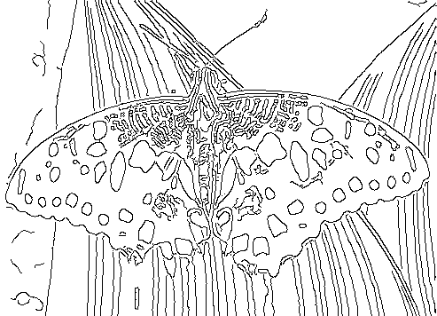

# 任务三 · OpenCV 轮廓检测

## 一、做法

题目里给的那个网站（One Last Image），我想它应该是**边缘检测 + 双色上色**：先把线提出来，再按一套规则把线分成暖色和冷色，最后合到白底上。所以它的底子，跟这道题要做的轮廓检测其实是一回事。

我自己就没往复杂了搞，用最基础的五个函数：

彩色图 → 灰度 → 高斯模糊 → Canny → findContours → drawContours

这个顺序是有讲究的。Canny 只认亮度变化，所以得先转灰度；模糊那一步也不能省——照片的噪点在 Canny 眼里也算边缘，不先抹掉的话出来就是满屏碎线，根本没法看。

## 二、代码

`opencv_ws/task3/src/contour_detect.cpp`，一共 39 行。

```cpp
// 任务三：对彩色图片做轮廓检测并绘制。
// 流程：读图 → 灰度 → 高斯模糊 → Canny 边缘 → findContours 找轮廓 → drawContours 画出来。
// 用法：./contour_detect <图片> <输出图> <Canny低阀值> <Canny高阀值>

#include <cstdlib>
#include <iostream>
#include <string>
#include <vector>

#include <opencv2/imgcodecs.hpp>   // imread / imwrite：读图和存图
#include <opencv2/imgproc.hpp>     // cvtColor / GaussianBlur / Canny / findContours / drawContours

int main(int argc, char** argv) {
    // 四个参数都有默认值，直接跑 ./contour_detect 也能用
    const std::string input = argc > 1 ? argv[1] : "images/official_input.jpg";
    const std::string output = argc > 2 ? argv[2] : "output/contours.png";
    const double canny_low = argc > 3 ? std::atof(argv[3]) : 35.0;
    const double canny_high = argc > 4 ? std::atof(argv[4]) : 105.0;

    const cv::Mat color = cv::imread(input, cv::IMREAD_COLOR);
    if (color.empty()) {
        std::cerr << "读不到图片: " << input << '\n';
        return 1;
    }

    // 1) 灰度化：Canny 只关心亮度变化，不需要颜色
    cv::Mat gray;
    cv::cvtColor(color, gray, cv::COLOR_BGR2GRAY);

    // 2) 高斯模糊：5x5 的核。抹掉噪点，避免检出满屏碎线
    cv::GaussianBlur(gray, gray, cv::Size(5, 5), 1.5);

    // 3) Canny 双阀值找边缘：低于低阀值的丢掉，高于高阀值的保留，
    //    卡在中间的看它有没有连着强边缘
    cv::Mat edges;
    cv::Canny(gray, edges, canny_low, canny_high);

    // 4) 找轮廓：RETR_LIST 取所有轮廓；CHAIN_APPROX_SIMPLE 只保留拐点，省内存
    std::vector<std::vector<cv::Point>> contours;
    cv::findContours(edges, contours, cv::RETR_LIST, cv::CHAIN_APPROX_SIMPLE);

    // 5) 画到白底上：contourIdx 传 -1 表示一次把所有轮廓都画出来，线宽 1
    cv::Mat canvas(color.size(), CV_8UC3, cv::Scalar(255, 255, 255));
    cv::drawContours(canvas, contours, -1, cv::Scalar(0, 0, 0), 1);

    cv::imwrite(output, canvas);

    std::cout << input << " -> " << output << "  轮廓 " << contours.size() << " 条\n";
    return 0;
}
```

```bash
cd /workspaces/RMCS/opencv_ws/task3
cmake -S . -B build
cmake --build build -j8
./build/contour_detect images/official_input.jpg output/official_contours.png
```

## 三、和官方输出比

光看着像不算数，我想还是得拿官方的原图跑一遍，再跟官方的输出对着看。

素材是这么弄的：官方仓库（[itorr/one-last-image](https://github.com/itorr/one-last-image)）里就带着演示原图，我把它下下来当输入；再把官方那个工具跑起来生成线稿，把结果图取回容器当"官方输出"。同一张图，能直接比。


左：原始彩色图 ｜ 中：官方输出线稿 ｜ 右：我的轮廓结果

结果基本对得上——人的外轮廓、帽子上的针织纹路、围巾、还有背包上面挂的那个小玩偶，位置都能对上。

要说差别，就是我这边只有一层轮廓线，官方那张还带一层很淡的"调子线"（发丝、布料纹理那种浅描），所以官方看着更满、我的更空。Canny 只认亮度突变，这种淡线抓不到。题目说的是"不要求渐变色一样、但轮廓差不多"，那我觉得这块是达标的。

换个输入也一样（同一份程序）：



## 四、调参

```bash
./build/contour_detect <图片> <输出图> <Canny低阀> <Canny高阀>
```

- 想让线条少一点、干净一点，两个阈值就都往大调
- 想细节全都要、宁可碎一点，那就两个都往小调

这两个阈值分工不太一样：**高阈值管的是"多强的边才算边"**，调大就只剩明显的边界了；**低阈值管的是"弱边能不能接上强边"**，调小一点，断掉的轮廓就能接起来。

我默认给的是 35/105——比常见的 60/180 能多抓些细节，也不至于碎成一片。这个数是我自己试出来的，你要是觉得线太多，就把高阈值往上提。

另外能动的还有：模糊核调大更干净，不过小细节也会被一起糊掉；`RETR_LIST` 换成 `RETR_EXTERNAL`，只留最外层轮廓、内部纹理全丢，出来就是简笔画的效果。
